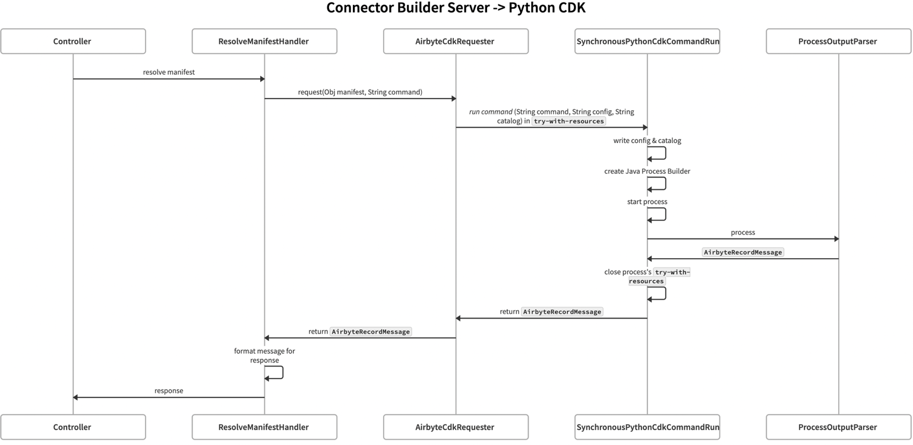

# Connector Builder

To whom it may concern: Prior to Airbyte OSS version `0.45.20`, the airbyte-connector-builder-server Docker image being used was written
in Python. After the rewrite of the server to Java and subsequent [release](https://github.com/airbytehq/airbyte-platform-internal/pull/6371),
we deprecated the old server and all image versions from `0.45.20` onward are backed by Java.

## Getting started

Install dependencies, compile, and build the server

The Connector Builder API server sends commands to an entrypoint of the Airbyte CDK. Therefore, to build the Connector Builder server, an installation of the CDK needs to be available and the `CDK_VERSION` environment needs to be set to a compatible version of the CDK.

The earliest compatible version of the CDK is 0.31.1.

```bash
./gradlew -p oss airbyte-connector-builder-server:build
```

To develop the server locally (without Docker), the `CDK_PYTHON` and `CDK_ENTRYPOINT` environment variables need to be set, where `CDK_PYTHON` is the path to the python interpreter you want to use, i.e. in which the CDK is installed, and `CDK_ENTRYPOINT` is the path to the Connector Builder entrypoint, located at <CDK directory/connector_builder/main.py>.
```bash
export CDK_PYTHON=<path_to_CDK_virtual_environment>
export CDK_ENTRYPOINT=<path_to_CDK_connector_builder_main.py>
```

Then run the server (You can also do this w/o build)
```bash
./gradlew -p oss airbyte-connector-builder-server:run
```

The server is now reachable on localhost:80

## OpenAPI generation

Run it via Gradle by running this from the Airbyte project root:
```bash
./gradlew -p oss airbyte-connector-builder-server:generateOpenApiServer
```

## Changing the used CDK version

TODO: The current `connector-builder-server` and `airbyte-webapp` must stay in sync using the same version of
the `airbyte-cdk` package. We can specify this as an environment variable in the top-level `.env` file. 
This has not been implemented yet, but we may also need to implement this in a follow-up change.

## Sequence diagram for handling Connector Builder requests

