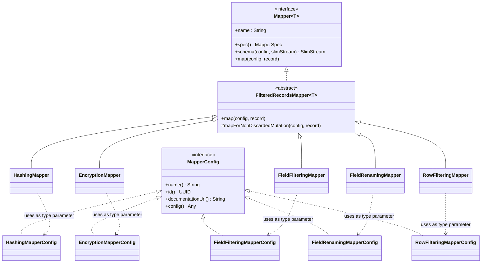
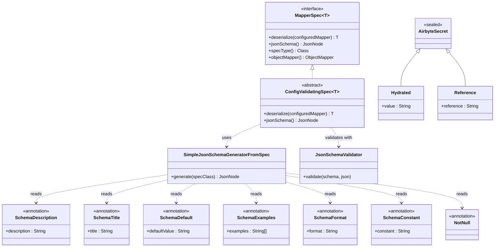
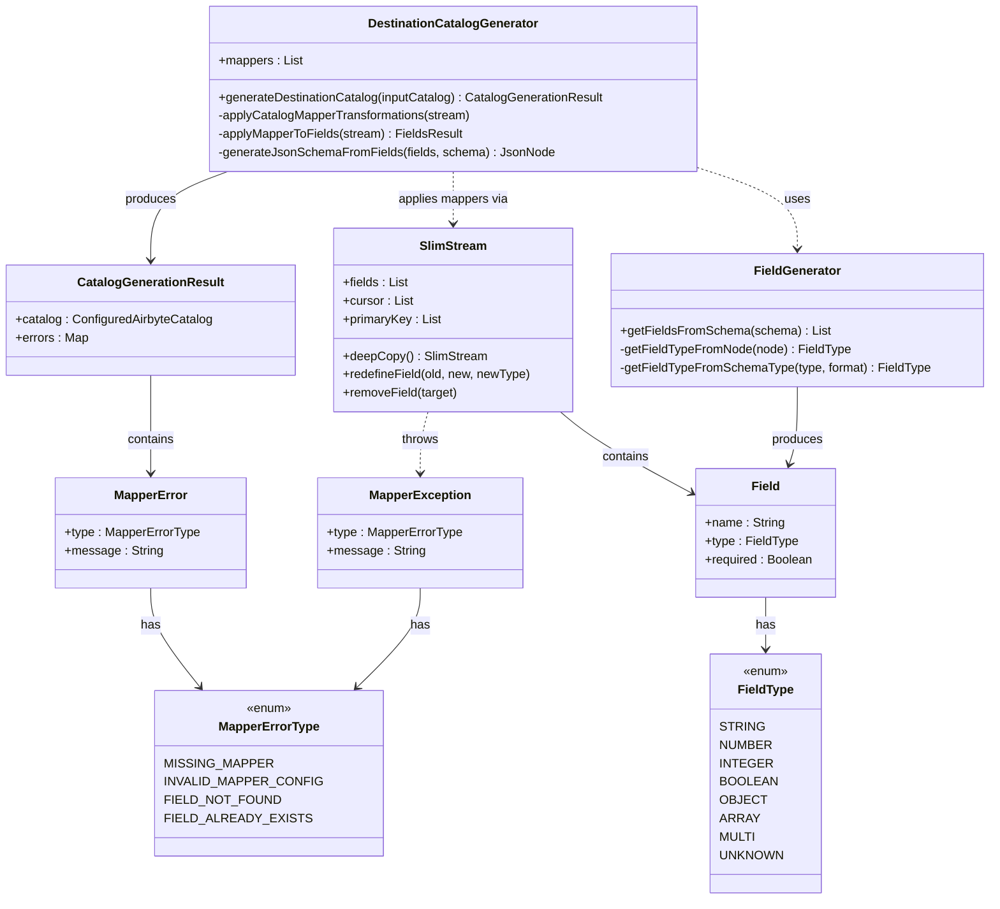
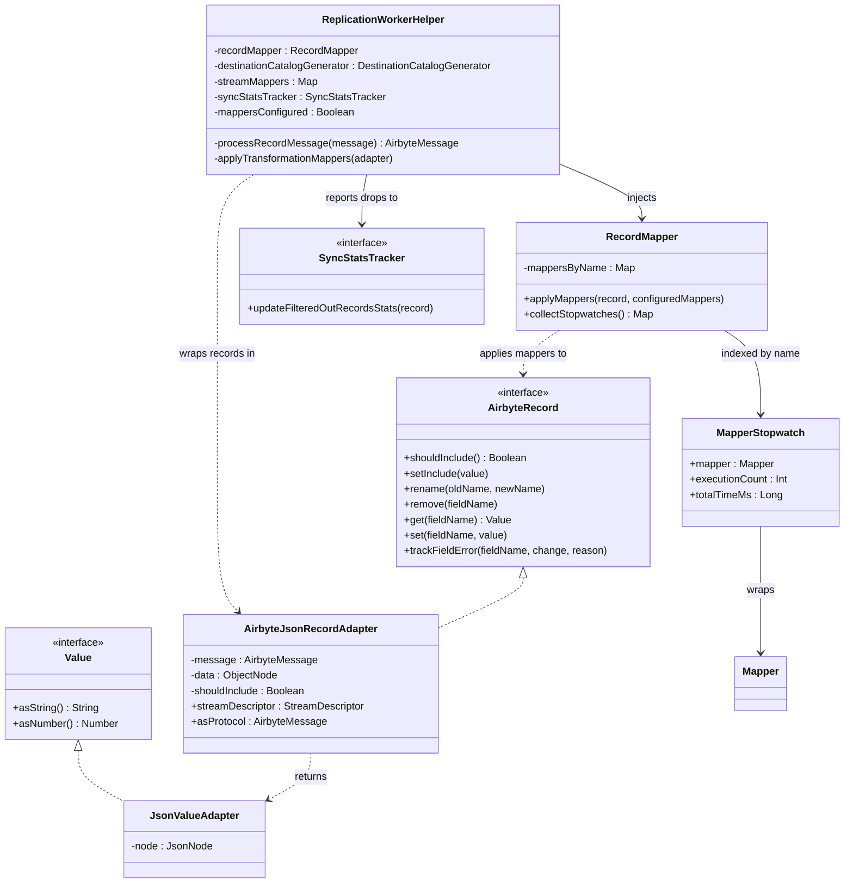

# Mappers / Field Hashing

## Contents

- [Introduction](#introduction)
- [7.1 Architecture](#71-architecture)
  - [Class organization](#class-organization)
  - [The five mappers](#the-five-mappers)
- [7.2 Spec Generation](#72-spec-generation)
  - [Class organization](#class-organization)
- [7.3 Catalog Transformation](#73-catalog-transformation)
  - [Step 1 -- Fields via `SlimStream`](#step-1-fields-via-slimstream)
  - [Step 2 -- JSON Schema regeneration](#step-2-json-schema-regeneration)
  - [Invalid mapper handling](#invalid-mapper-handling)
  - [Class organization](#class-organization)
- [7.4 Field generation from JSON Schema](#74-field-generation-from-json-schema)
- [7.5 Runtime Application](#75-runtime-application)
  - [Class organization](#class-organization)
  - [`ReplicationWorkerHelper`](#replicationworkerhelper)
  - [`RecordMapper`](#recordmapper)
  - [`AirbyteJsonRecordAdapter` and the rename-to-self fix](#airbytejsonrecordadapter-and-the-rename-to-self-fix)
- [7.6 The Two Mapper Systems](#76-the-two-mapper-systems)
- [7.7 Mapper Secrets](#77-mapper-secrets)
  - [The `AirbyteSecret` sealed class](#the-airbytesecret-sealed-class)
  - [`MapperSecretHelper`](#mappersecrethelper)
- [7.8 API Surface](#78-api-surface)
  - [Legacy `hashedFields` list](#legacy-hashedfields-list)
- [7.9 Performance Metrics](#79-performance-metrics)
- [7.10 Past Issues](#710-past-issues)
  - [7.10.1 Internal API revert dance (PRs #13859 / #13865)](#7101-internal-api-revert-dance-prs-13859-13865)
  - [7.10.2 Catalog rewriting missed in the monopod worker (PR #13918)](#7102-catalog-rewriting-missed-in-the-monopod-worker-pr-13918)
  - [7.10.3 Invalid mapper config would fail the entire connection (PR #13825)](#7103-invalid-mapper-config-would-fail-the-entire-connection-pr-13825)
  - [7.10.4 Rename-to-self deletes the field (PR #16754)](#7104-rename-to-self-deletes-the-field-pr-16754)
  - [7.10.5 Discover cache key missed on the job-input-service path (PR #16553)](#7105-discover-cache-key-missed-on-the-job-input-service-path-pr-16553)
- [7.11 Potential Improvements](#711-potential-improvements)
  - [7.11.1 Add a metric for stripped invalid mappers](#7111-add-a-metric-for-stripped-invalid-mappers)
  - [7.11.2 Disambiguate the two `Mapper` interfaces](#7112-disambiguate-the-two-mapper-interfaces)
  - [7.11.3 Remove the legacy `hashedFields` path](#7113-remove-the-legacy-hashedfields-path)

The mapper system applies in-flight, platform-side transformations to records during replication: hash a PII field, encrypt a credit-card column, drop a row that fails a predicate, rename a field, filter a column out before it reaches the destination. Mappers are configured per-stream on `ConfiguredAirbyteStream.mappers`, applied in order, and rewrite both the destination catalog (so the destination sees the transformed schema) and each record at runtime.

## Introduction

The system was built jointly by Benoit and Jimmy (`gosusnp`) in three roughly-sequential phases:

1. **Core architecture and the hashing mapper** -- Benoit, August--September 2024. Introduced the `airbyte-mappers` module, the `Mapper<T : MapperConfig>` interface, catalog rewriting via `DestinationCatalogGenerator`, runtime application via `RecordMapper`, and the first concrete mapper (`HashingMapper`).
2. **Encryption and the secrets sealed type** -- Jimmy, October--November 2024. Added the `EncryptionMapper` (AES + RSA), the `AirbyteSecret` sealed class with custom Jackson serde, and refactored error reporting into structured `MapperError` + `MapperErrorType`.
3. **Field filtering, API exposure, and post-rollout fixes** -- Jimmy, 2025. Added `FieldFilteringMapper`, exposed all five mappers through `ConfiguredStreamMapper` in the public API, and shipped two notable production fixes (rename-to-self, discover config hashing).

Two distinct types are both called "Mapper" in the codebase. `Mapper<T>` in `airbyte-mappers` is the field/record-transform system documented here. `AirbyteMapper` in `airbyte-commons-worker` is the **namespacing mapper** that handles destination namespace and stream-prefix rewrites. They are unrelated systems applied in sequence -- see [§7.6](#76-the-two-mapper-systems).

## 7.1 Architecture

The [`oss/airbyte-mappers/`](../../oss/airbyte-mappers/) module is small (~20 files) and has no platform dependencies. The core abstractions:

[`oss/airbyte-mappers/src/main/kotlin/io/airbyte/mappers/transformations/Mapper.kt:10`](../../oss/airbyte-mappers/src/main/kotlin/io/airbyte/mappers/transformations/Mapper.kt):

```kotlin
interface Mapper<T : MapperConfig> {
  val name: String
  fun spec(): MapperSpec<T>
  fun schema(config: T, slimStream: SlimStream): SlimStream  // catalog-time
  fun map(config: T, record: AirbyteRecord)                  // runtime
}
```

`MapperConfig` (in [`oss/airbyte-config/config-models/src/main/kotlin/io/airbyte/config/Mappers.kt:50`](../../oss/airbyte-config/config-models/src/main/kotlin/io/airbyte/config/Mappers.kt)) uses Jackson `@JsonTypeInfo` + `@JsonSubTypes` to dispatch on the `name` field, so a `ConfiguredAirbyteStream.mappers: List<MapperConfig>` polymorphically deserializes into the right concrete config class.

All five concrete mappers extend the abstract `FilteredRecordsMapper<T>` ([`FilteredRecordsMapper.kt:10`](../../oss/airbyte-mappers/src/main/kotlin/io/airbyte/mappers/transformations/FilteredRecordsMapper.kt)), which short-circuits if a previous mapper in the chain marked the record as not-included:

```kotlin
final override fun map(config: T, record: AirbyteRecord) {
  if (!record.shouldInclude()) return
  mapForNonDiscardedMutation(config, record)
}
```

Each mapper is a Micronaut `@Singleton` -- the full list is injected as `List<Mapper<out MapperConfig>>` into both `DestinationCatalogGenerator` and `RecordMapper`.

### Class organization

Mapper hierarchy paired with their `MapperConfig` types. Each concrete mapper is parameterized on its concrete config class.



### The five mappers

| Class | Name string | Purpose |
|-------|-------------|---------|
| `HashingMapper` ([`HashingMapper.kt:19`](../../oss/airbyte-mappers/src/main/kotlin/io/airbyte/mappers/transformations/HashingMapper.kt)) | `hashing` | Hashes a field value using one of 7 algorithms (MD2, MD5, SHA-1, SHA-224, SHA-256, SHA-384, SHA-512). Renames the field and changes the type to STRING. |
| `EncryptionMapper` ([`EncryptionMapper.kt:40`](../../oss/airbyte-mappers/src/main/kotlin/io/airbyte/mappers/transformations/EncryptionMapper.kt)) | `encryption` | AES (CBC/CFB/OFB/CTR/GCM/ECB × NoPadding/PKCS5Padding) or RSA (with hex-encoded public key). For AES, prepends the IV to the ciphertext. |
| `FieldFilteringMapper` ([`FieldFilteringMapper.kt:16`](../../oss/airbyte-mappers/src/main/kotlin/io/airbyte/mappers/transformations/FieldFilteringMapper.kt)) | `field-filtering` | Drops the field from both the schema and every record. |
| `FieldRenamingMapper` ([`FieldRenamingMapper.kt:16`](../../oss/airbyte-mappers/src/main/kotlin/io/airbyte/mappers/transformations/FieldRenamingMapper.kt)) | `field-renaming` | Renames a field (no type change). |
| `RowFilteringMapper` ([`RowFilteringMapper.kt:21`](../../oss/airbyte-mappers/src/main/kotlin/io/airbyte/mappers/transformations/RowFilteringMapper.kt)) | `row-filtering` | Evaluates an AND/OR/NOT/EQUAL boolean tree against the record; on `false`, calls `record.setInclude(false)`. **Schema is identity** -- this mapper does not touch the catalog. |

> **Naming gotcha:** the name strings use hyphens (`field-filtering`, `field-renaming`, `row-filtering`), not underscores. They are defined in [`Mappers.kt:26-30`](../../oss/airbyte-config/config-models/src/main/kotlin/io/airbyte/config/Mappers.kt) as `MapperOperationName` constants and double as the `@JsonTypeInfo` discriminator values.

## 7.2 Spec Generation

Specs (the JSON Schema that the UI uses to render the config form) are generated by reflection from annotations on the Kotlin config data classes, not hand-written.

- **Annotations:** [`oss/airbyte-config/config-models/src/main/kotlin/io/airbyte/config/mapper/configs/MapperSpecAnnotations.kt`](../../oss/airbyte-config/config-models/src/main/kotlin/io/airbyte/config/mapper/configs/MapperSpecAnnotations.kt) -- `@SchemaDescription`, `@SchemaTitle`, `@SchemaDefault`, `@SchemaExamples`, `@SchemaFormat`, `@SchemaConstant`, `@NotNull`.
- **Generator:** [`oss/airbyte-mappers/src/main/kotlin/io/airbyte/mappers/transformations/SimpleJsonSchemaGeneratorFromSpec.kt`](../../oss/airbyte-mappers/src/main/kotlin/io/airbyte/mappers/transformations/SimpleJsonSchemaGeneratorFromSpec.kt) walks the data class and emits a JSON schema honouring those annotations.
- **Base class:** `ConfigValidatingSpec` ([`ConfigValidatingSpec.kt:15`](../../oss/airbyte-mappers/src/main/kotlin/io/airbyte/mappers/transformations/ConfigValidatingSpec.kt)) runs `JsonSchemaValidator` against the produced schema during `deserialize(...)` so invalid configs fail fast at catalog-generation time.
- **Interface:** `MapperSpec<T>` ([`MapperSpec.kt:12`](../../oss/airbyte-mappers/src/main/kotlin/io/airbyte/mappers/transformations/MapperSpec.kt)) -- `deserialize`, `jsonSchema`, `specType`, `objectMapper`.

This was introduced in [PR #13594](https://github.com/airbytehq/airbyte-platform-internal/pull/13594) and extended for encryption by [PR #14536](https://github.com/airbytehq/airbyte-platform-internal/pull/14536) (AES Mode / Padding enums, runtime validation of impossible AES combinations such as GCM-with-PKCS5Padding).

### Class organization



`AirbyteSecret` is included here because mapper specs declare secret fields by typing them as `AirbyteSecret` (e.g. `EncryptionMapperConfig.key`). The custom Jackson serde on this sealed class is what lets configs round-trip between hydrated and `_secret`-reference shapes -- see [§7.7](#77-mapper-secrets).

## 7.3 Catalog Transformation

[`oss/airbyte-mappers/src/main/kotlin/io/airbyte/mappers/transformations/DestinationCatalogGenerator.kt:24`](../../oss/airbyte-mappers/src/main/kotlin/io/airbyte/mappers/transformations/DestinationCatalogGenerator.kt) -- `@Singleton class DestinationCatalogGenerator(val mappers: List<Mapper<out MapperConfig>>, ...)`.

The entrypoint `generateDestinationCatalog(inputCatalog)` (line 51) returns:

```kotlin
data class CatalogGenerationResult(
  val catalog: ConfiguredAirbyteCatalog,
  val errors: Map<StreamDescriptor, Map<MapperConfig, MapperError>>,
)
```

For each stream, it runs a two-step process inside `applyCatalogMapperTransformations` (lines 60-81):

### Step 1 -- Fields via `SlimStream`

`applyMapperToFields` (lines 89-152) folds each `MapperConfig` over an initially-empty `SlimStream`. `SlimStream` ([`SlimStream.kt:13`](../../oss/airbyte-mappers/src/main/kotlin/io/airbyte/mappers/transformations/SlimStream.kt)) is the mutable, catalog-time working state: `fields`, `cursor`, `primaryKey`, `sourceDefaultCursor`, `sourceDefinedPrimaryKey`.

Two key mutations:
- **`redefineField(oldName, newName, newType?)`** (`SlimStream.kt:66-95`) -- used by `HashingMapper` (rename + retype to STRING) and `FieldRenamingMapper` (rename only). Also rewrites cursor and primary-key references so they survive the rename.
- **`removeField(targetName)`** (`SlimStream.kt:97-110`) -- added by [PR #17234](https://github.com/airbytehq/airbyte-platform-internal/pull/17234) for `FieldFilteringMapper`. Strips the field and removes it from cursor/PK references.

### Step 2 -- JSON Schema regeneration

After the fold completes, `applyCatalogMapperTransformations` rebuilds the stream's JSON schema from the final `SlimStream.fields` (lines 63-72), then writes `cursorField`, `primaryKey`, `sourceDefinedPrimaryKey`, and `defaultCursorField` back onto the stream (lines 73-78). For complex types (OBJECT, ARRAY, MULTI, UNKNOWN), `generateJsonSchemaFromFields` (lines 154-166) reuses the original schema's sub-tree rather than synthesising one.

### Invalid mapper handling

`applyMapperToFields` (lines 89-152) is defensive: any failure during a mapper's `schema()` call is captured rather than thrown.

- **Unknown mapper name** (lines 110-119): logs a warning, records `MapperError(type = MISSING_MAPPER, ...)`.
- **`MapperException`** (lines 126-131, raised from `SlimStream` or the mapper itself): records `MapperError(type = e.type, ...)`.
- **Any other exception** (lines 132-145): records `MapperError(type = INVALID_MAPPER_CONFIG, ...)`.

At line 149, `stream.mappers = result.validConfig` -- **the invalid mappers are stripped from the stream**, so the sync proceeds without them. The errors are surfaced via the returned `CatalogGenerationResult.errors`, which `ConnectionsHandler` (and friends) can show to the user.

This behaviour replaced a hard-fail in [PR #13825](https://github.com/airbytehq/airbyte-platform-internal/pull/13825) -- see [§7.10.3](#7103-invalid-mapper-config-would-fail-the-entire-connection-pr-13825).

The `MapperError` data class and `MapperErrorType` enum (`MISSING_MAPPER`, `INVALID_MAPPER_CONFIG`, `FIELD_NOT_FOUND`, `FIELD_ALREADY_EXISTS`, ...) are declared inside `DestinationCatalogGenerator.kt:30-40`, added by [PR #14620](https://github.com/airbytehq/airbyte-platform-internal/pull/14620). Before that PR, mapper failures were a flat exception with a free-text message.

### Class organization



`MapperError` is the structured-error type returned in `CatalogGenerationResult.errors`. `MapperException` is the in-band throw used by `SlimStream` and mapper `schema()` implementations; `DestinationCatalogGenerator` catches it and converts to a `MapperError` entry. Both share the `MapperErrorType` enum.

## 7.4 Field generation from JSON Schema

`FieldGenerator` ([`oss/airbyte-config/config-models/src/main/kotlin/io/airbyte/config/helpers/FieldGenerator.kt`](../../oss/airbyte-config/config-models/src/main/kotlin/io/airbyte/config/helpers/FieldGenerator.kt)) translates a stream's JSON Schema into a `List<Field>` so `SlimStream` can work with strongly-typed fields rather than raw JSON. Entrypoint at line 39:

```kotlin
fun getFieldsFromSchema(schema: JsonNode): List<Field>
```

Two defensive behaviours, both Benoit's, both motivated by encountering schemas in the wild:

- **Unknown types** ([PR #13818](https://github.com/airbytehq/airbyte-platform-internal/pull/13818)): a `type`-less property returns `FieldType.UNKNOWN`. The catalog rewrite still passes the field through to the destination unchanged.
- **Malformed schemas** ([PR #13950](https://github.com/airbytehq/airbyte-platform-internal/pull/13950)): the whole `getFieldTypeFromNode` body (lines 63-86) is wrapped in `try/catch`. On failure it logs a warning and returns `FieldType.UNKNOWN`. Catalog generation does not crash on a connector that emits non-spec-compliant JSON schemas.

`getFieldTypeFromSchemaType` (lines 88-136) handles the `string + format + airbyte_type` combinations for date / datetime-with-tz / datetime-without-tz / time variants.

## 7.5 Runtime Application

Records flow through the mapper system per-record, in the worker. At a high level:

1. The source connector emits an `AirbyteMessage` (RECORD).
2. `ReplicationWorkerHelper.processRecordMessage` wraps it in an `AirbyteJsonRecordAdapter` (only if `mappersConfigured`).
3. `RecordMapper.applyMappers(adapter, mappers)` folds the configured mappers over the adapter, in order. Each mapper's runtime is measured into a per-mapper stopwatch.
4. If `adapter.shouldInclude() == false` (because `RowFilteringMapper` flipped the flag), the record is dropped and `syncStatsTracker.updateFilteredOutRecordsStats(...)` is called.
5. Otherwise the (possibly-mutated) message is forwarded to the destination connector.

### Class organization



`MapperStopwatch` is a private inner data class on `RecordMapper`; it tracks per-mapper execution count and total time. The `collectStopwatches()` output is what surfaces as `PerformanceMetrics.mappers` in [§7.9](#79-performance-metrics).

### `ReplicationWorkerHelper`

The wiring lives in the container-orchestrator ([`oss/airbyte-container-orchestrator/src/main/kotlin/io/airbyte/container/orchestrator/worker/ReplicationWorkerHelper.kt`](../../oss/airbyte-container-orchestrator/src/main/kotlin/io/airbyte/container/orchestrator/worker/ReplicationWorkerHelper.kt)). The historical `ReplicationWorkerFactory.java` referenced in older docs is gone; `RecordMapper` and `DestinationCatalogGenerator` are now Micronaut-injected (constructor params at lines 73 and 77).

- **Initialization** (line 123): `destinationCatalogGenerator.generateDestinationCatalog(context.configuredCatalog)` runs catalog rewriting once at startup. `streamMappers` is a `Map<StreamDescriptor, List<MapperConfig>>` built from the result (line 124).
- **Per-record path** (`processRecordMessage`, lines 286-298):
  ```kotlin
  if (mappersConfigured) {
    val adapter = AirbyteJsonRecordAdapter(sourceRawMessage)
    applyTransformationMappers(adapter)
    if (!adapter.shouldInclude()) {
      syncStatsTracker.updateFilteredOutRecordsStats(sourceRawMessage.record)
      return null
    }
  }
  ```
- **`applyTransformationMappers`** (line 328): `streamMappers[descriptor]?.let { recordMapper.applyMappers(adapter, it) }`.

### `RecordMapper`

[`oss/airbyte-mappers/src/main/kotlin/io/airbyte/mappers/application/RecordMapper.kt:17`](../../oss/airbyte-mappers/src/main/kotlin/io/airbyte/mappers/application/RecordMapper.kt). Each mapper is wrapped in a private `MapperStopwatch` (lines 21-25) and indexed by name. `applyMappers` (lines 29-48) folds over the configured-mapper list:

```kotlin
configuredMappers.fold(record) { acc, mapperConfig ->
  mappersByName[mapperConfig.name()]?.let { stopwatch ->
    stopwatch.executionCount++
    stopwatch.totalTimeMs += measureTime {
      (stopwatch.mapper as Mapper<T>).map(mapperConfig, acc)
    }.toLong(DurationUnit.MILLISECONDS)
  }
  acc
}
```

Two important behaviours:
- **Unknown mappers are silently skipped.** The fold returns `acc` unchanged if the mapper name isn't registered. This is the runtime complement to the catalog-time `MISSING_MAPPER` error: by the time records flow, invalid mappers have already been stripped from the stream's `mappers` list ([§7.3](#73-catalog-transformation)), so this branch should be unreachable in practice.
- **Exceptions are swallowed at `DEBUG`** (line 45). A misbehaving mapper does not stop the sync. Errors on a *single field* are surfaced via `record.trackFieldError(...)` (see `HashingMapper.kt:76` and `FieldRenamingMapper.kt:46`) and propagate as `AirbyteRecordMessageMetaChange` metadata on the record.

### `AirbyteJsonRecordAdapter` and the rename-to-self fix

The interface `AirbyteRecord` ([`oss/airbyte-mappers/src/main/kotlin/io/airbyte/mappers/adapters/AirbyteRecord.kt:7`](../../oss/airbyte-mappers/src/main/kotlin/io/airbyte/mappers/adapters/AirbyteRecord.kt)) stays in `airbyte-mappers` so the module has no protocol dependency. The concrete adapter that wraps an `AirbyteMessage` lives in the container-orchestrator: [`oss/airbyte-container-orchestrator/src/main/kotlin/io/airbyte/container/orchestrator/worker/model/adapter/JsonAdapters.kt:30`](../../oss/airbyte-container-orchestrator/src/main/kotlin/io/airbyte/container/orchestrator/worker/model/adapter/JsonAdapters.kt).

The `rename(oldFieldName, newFieldName)` method short-circuits when old equals new (lines 49-57):

```kotlin
override fun rename(oldFieldName: String, newFieldName: String) {
  ...
  if (newFieldName != oldFieldName) {
    data.set<JsonNode>(newFieldName, data[oldFieldName])
    data.remove(oldFieldName)
  }
}
```

Without the guard, a `set`-then-`remove` sequence would delete the field entirely. This was [PR #16754](https://github.com/airbytehq/airbyte-platform-internal/pull/16754) -- see [§7.10.4](#7104-rename-to-self-deletes-the-field-pr-16754).

`trackFieldError` (lines 66-83) appends an `AirbyteRecordMessageMetaChange` under `synchronized(message.record) { ... }`, which is the only point of synchronisation in the adapter -- per-record write paths are otherwise single-threaded.

## 7.6 The Two Mapper Systems

The `Mapper<T>` system described above is one of **two independent mapper pipelines** that run during replication. The other is the **namespacing mapper**, applied after transformation mappers, that handles namespace and stream-name rewrites required by the destination's `NamespaceDefinitionType` and `streamPrefix` config.

- **Interface:** `AirbyteMapper` ([`oss/airbyte-commons-worker/src/main/kotlin/io/airbyte/workers/internal/Mapper.kt:21`](../../oss/airbyte-commons-worker/src/main/kotlin/io/airbyte/workers/internal/Mapper.kt)) -- `mapCatalog`, `mapMessage`, `revertMap`.
- **Implementation:** `NamespacingMapper` (same file, line 42).
- **Wiring:** `ReplicationWorkerHelper.kt:127` calls `mapper.mapCatalog(catalog)` once at init; line 325 calls `mapper.mapMessage(record)` per-record; line 198 calls `mapper.revertMap(...)` on state messages flowing back from the destination (so the source sees its original namespace in state).
- **Order:** namespace mapping is applied **after** transformation mappers but before the message reaches the destination.

The naming overlap is unfortunate -- both interfaces are called "Mapper" in their respective packages. They are not related and do not share code. The historical reason is that namespacing predates the per-field mapper system by years.

## 7.7 Mapper Secrets

Encryption mappers (and only AES, in practice) hold secret material: AES keys. The secret model and the handler are both Jimmy's work.

### The `AirbyteSecret` sealed class

[`oss/airbyte-config/config-models/src/main/kotlin/io/airbyte/config/AirbyteSecret.kt:19`](../../oss/airbyte-config/config-models/src/main/kotlin/io/airbyte/config/AirbyteSecret.kt) (added in [PR #14522](https://github.com/airbytehq/airbyte-platform-internal/pull/14522)):

```kotlin
@JsonDeserialize(using = AirbyteSecret.Deserializer::class)
@JsonSerialize(using = AirbyteSecret.Serializer::class)
sealed class AirbyteSecret {
  companion object { const val SECRET_REFERENCE_FIELD_NAME = "_secret" }
  data class Hydrated(val value: String) : AirbyteSecret()
  data class Reference(val reference: String) : AirbyteSecret()
}
```

The custom Jackson serde (lines 32-61) preserves two on-wire shapes:
- **Hydrated** ↔ plain string (`"abc123"`).
- **Reference** ↔ `{ "_secret": "<coord>" }`.

This was introduced to give mappers a strongly-typed secret field without breaking the existing `_secret`-reference convention used everywhere else in the codebase.

### `MapperSecretHelper`

[`oss/airbyte-commons-server/src/main/kotlin/io/airbyte/commons/server/handlers/helpers/MapperSecretHelper.kt`](../../oss/airbyte-commons-server/src/main/kotlin/io/airbyte/commons/server/handlers/helpers/MapperSecretHelper.kt):

| Method | Line | What it does |
|--------|------|--------------|
| `createAndReplaceMapperSecrets(workspaceId, catalog)` | 183 | On connection create. Walks every stream's mappers; for each, writes new secrets via `secretsRepositoryWriter.createFromConfigLegacy(...)` and returns a catalog with secrets replaced by `_secret` references. |
| `updateAndReplaceMapperSecrets(workspaceId, oldCatalog, newCatalog)` | 214 | On connection update. Re-hydrates old config, uses `secretsProcessor.copySecrets(...)` to carry forward any masked values the caller supplied (so the UI can update non-secret fields without re-uploading secrets), then writes via `updateFromConfigLegacy(...)`. |
| `maskMapperSecrets(catalog)` | 263 | On API output. Replaces secret values with `AirbyteSecretConstants.SECRETS_MASK` via `secretsProcessor.prepareSecretsForOutput(...)`. |

Cloud-specific behaviour:
- `shouldRequireRuntimePersistence` (line 81): in Cloud, an AES-mode encryption mapper requires an org-scoped (runtime) secret persistence unless `AllowMappersDefaultSecretPersistence` feature flag is enabled.
- `getRuntimeSecretPersistence` (line 99): gated by `UseRuntimeSecretPersistence`.
- `assertConfigHasNoMaskedSecrets` (line 108): on initial create, refuses to persist a masked value -- callers must supply real secrets the first time.

## 7.8 API Surface

The public API exposes all five mapper types through `ConfiguredStreamMapper` (in OpenAPI). The conversion between API and internal models lives in [`oss/airbyte-commons-converters/src/main/kotlin/io/airbyte/commons/converters/MapperConverters.kt`](../../oss/airbyte-commons-converters/src/main/kotlin/io/airbyte/commons/converters/MapperConverters.kt):

- **API → internal:** `ConfiguredStreamMapper.toInternal()` (line 149) is a `when` over `StreamMapperType` that builds the right concrete `MapperConfig`. Validation errors are translated into `MapperValidationInvalidConfigProblem` (line 208) and `MapperValidationMissingRequiredParamProblem` (line 215) so the UI sees structured errors.
- **Internal → API:** `MapperConfig.toApi()` (line 333) is the inverse `when`, with per-mapper `toApi()` extensions starting at line 223.

`FieldFilteringMapper` was the last to be wired through this path -- internal support [PR #17234](https://github.com/airbytehq/airbyte-platform-internal/pull/17234), API exposure [PR #17245](https://github.com/airbytehq/airbyte-platform-internal/pull/17245).

Secrets are masked at the API boundary: `AirbyteSecret.toApi()` (line 299) returns the raw value for `Hydrated` and `AirbyteSecretConstants.SECRETS_MASK` for `Reference` -- so a secret reference is never leaked.

### Legacy `hashedFields` list

The original UI shipped before the mapper system existed and used a `hashedFields: List<SelectedFieldInfo>` on the stream config. That field is still wired through for back-compat:

- [`oss/airbyte-commons-server/src/main/kotlin/io/airbyte/commons/server/handlers/helpers/CatalogConverter.kt:246-251`](../../oss/airbyte-commons-server/src/main/kotlin/io/airbyte/commons/server/handlers/helpers/CatalogConverter.kt) -- `toConfiguredHashingMappers(hashedFields)` translates the legacy list into `List<HashingMapperConfig>` on API input.
- Same file, line 103-105 -- `.hashedFields(...)` is still populated on API output for the UI to read.
- `CatalogMergeHelper.kt:101-107` -- when merging schemas during auto-propagation, `hashedFields` carries forward.
- [`oss/airbyte-api/server-api/src/main/openapi/config.yaml:17239-17240`](../../oss/airbyte-api/server-api/src/main/openapi/config.yaml) -- the field is annotated with a `TODO: remove hashedFields once the UI is updated to use mappers` comment. As of master, the UI migration is the blocker. See [§7.11.3](#7113-remove-the-legacy-hashedfields-path).

## 7.9 Performance Metrics

Each mapper's runtime cost is tracked per-sync. `RecordMapper.collectStopwatches()` (`RecordMapper.kt:50-54`) returns a `Map<String, Long>` of `mapperName → totalTimeMs`, filtered to the mappers that actually ran. It's published into `PerformanceMetrics` at `ReplicationWorkerHelper.kt:368-370`:

```kotlin
val mapperMetrics = recordMapper.collectStopwatches()
if (mapperMetrics.isNotEmpty()) {
  setAdditionalProperty("mappers", mapperMetrics)
}
```

This makes it possible to see, in the per-job perf summary, that (say) `encryption` consumed 12% of the per-record time across a sync. Useful for identifying mapper-induced slowdowns without per-record tracing.

## 7.10 Past Issues

### 7.10.1 Internal API revert dance ([PRs #13859 / #13865](https://github.com/airbytehq/airbyte-platform-internal/pull/13865))

The internal API to wire field hashing into the connection-level config was added, immediately reverted, then re-introduced under a feature flag three days later.

#### How we got there

The first version of the API ([PR #13859](https://github.com/airbytehq/airbyte-platform-internal/pull/13859) reverted what was originally an additive PR) shipped without a feature-flag gate. A test in production revealed a payload-shape change that broke the UI for some workspaces that hadn't yet adopted the new shape.

#### What we did to fix it

[PR #13865](https://github.com/airbytehq/airbyte-platform-internal/pull/13865) re-introduced the same API but routed all new-shape population behind a feature flag. The flag was flipped to true ([PR #13945](https://github.com/airbytehq/airbyte-platform-internal/pull/13945)) once UI compat was confirmed, and the flag was removed entirely ([PR #14098](https://github.com/airbytehq/airbyte-platform-internal/pull/14098)) a week later.

#### Lessons

- For any API shape change that the UI consumes, default to feature-flag gating from the first PR. The cost of adding a flag preemptively is trivial; the cost of a revert-fix-reintroduce cycle is a week of churn.
- The kill-switch is worth keeping for at least one release cycle after the rollout completes.

### 7.10.2 Catalog rewriting missed in the monopod worker ([PR #13918](https://github.com/airbytehq/airbyte-platform-internal/pull/13918))

Initial catalog-rewriting was wired only into the "triplet" worker architecture (source + orchestrator + destination as separate pods). The newer monopod worker architecture skipped the rewrite, so destinations launched in monopod mode received the original (un-mapped) catalog and rejected records that the rewrite would have made conformant.

#### How we got there

At the time of [PR #13688](https://github.com/airbytehq/airbyte-platform-internal/pull/13688) (catalog generation), monopod was a minor variant. By [#13918](https://github.com/airbytehq/airbyte-platform-internal/pull/13918) it was the default path. The rewrite was never wired into `ReplicationHydrationProcessor` for monopod, so the integration shipped half-active.

#### What we did to fix it

Moved the catalog-rewrite call out of the triplet-specific code path and into `ReplicationHydrationProcessor.kt` so both architectures share it. Also removed an unused `connectionId` parameter from `DestinationCatalogGenerator` as a small cleanup.

#### Lessons

- When two worker architectures coexist, any new replication-time wiring needs an integration test in both. The monopod path was not exercised end-to-end during the original mapper rollout.

### 7.10.3 Invalid mapper config would fail the entire connection ([PR #13825](https://github.com/airbytehq/airbyte-platform-internal/pull/13825))

The first cut of `DestinationCatalogGenerator` threw a `MapperException` on any invalid config -- a renamed-to-itself field, an encryption key shorter than the AES requirement, a missing column. Auto-propagation routinely produces such configs (the source dropped a column the mapper was hashing), and the resulting hard-fail blocked the sync entirely.

#### How we got there

Defensive validation was correct on first principles, but the platform's auto-propagation can mutate a stream's shape between the time the mapper was configured and the time the sync runs. A misconfigured mapper should degrade gracefully (skip the mapper) rather than fail the sync (block the user's data).

#### What we did to fix it

Refactored `applyMapperToFields` (`DestinationCatalogGenerator.kt:89-152`) to catch each mapper's failure independently:
1. Log a warning with the error type.
2. Accumulate the error in a `Map<MapperConfig, MapperError>` per stream.
3. Strip the invalid mapper from the stream's mapper list.
4. Return successfully so the sync proceeds without that mapper.

The errors are surfaced to the user through the `CatalogGenerationResult.errors` map.

#### Lessons

- Defensive throwing in a catalog-time validation is an availability cost: every "valid" sync also pays for the strictness, but the failure mode (hard-fail) is worse than the alternative (silent skip + report).
- A metric counting `INVALID_MAPPER_CONFIG` would help spot user-facing breakages without log-diving. As of master this metric is not wired -- see [§7.11.1](#7111-add-a-metric-for-stripped-invalid-mappers).

### 7.10.4 Rename-to-self deletes the field ([PR #16754](https://github.com/airbytehq/airbyte-platform-internal/pull/16754))

A user configured a `field-renaming` mapper with `originalFieldName == newFieldName` and saw the field disappear from every record.

#### How we got there

`AirbyteJsonRecordAdapter.rename` did:

```kotlin
data.set<JsonNode>(newFieldName, data[oldFieldName])
data.remove(oldFieldName)
```

When `oldFieldName == newFieldName`, the `set` is a no-op (overwriting with the same value) and the `remove` then deletes the field outright.

The configuration shape is unusual but legitimate: it can arise when a user is testing a renaming pipeline locally, or when a workflow auto-generates rename pairs that occasionally collapse to identity.

#### What we did to fix it

[`JsonAdapters.kt:53`](../../oss/airbyte-container-orchestrator/src/main/kotlin/io/airbyte/container/orchestrator/worker/model/adapter/JsonAdapters.kt) -- one-line guard:

```kotlin
if (newFieldName != oldFieldName) {
  data.set<JsonNode>(newFieldName, data[oldFieldName])
  data.remove(oldFieldName)
}
```

The `schema()` side of `FieldRenamingMapper` already short-circuits this case via `SlimStream.redefineField`, which throws `FIELD_ALREADY_EXISTS` on a self-rename and lets the existing invalid-mapper-stripping logic ([§7.10.3](#7103-invalid-mapper-config-would-fail-the-entire-connection-pr-13825)) drop the mapper. The runtime side did not have the equivalent guard.

#### Lessons

- Symmetry between catalog-time and runtime mappers matters. If `schema()` would refuse a config, `map()` should refuse it the same way -- not silently destroy data.
- A property-based test that runs every concrete mapper through identity-shaped inputs would have caught this.

### 7.10.5 Discover cache key missed on the job-input-service path ([PR #16553](https://github.com/airbytehq/airbyte-platform-internal/pull/16553))

Unrelated to field hashing despite the name overlap. `JobInputService` computes an MD5 hash of the source config and passes it to the discover-catalog activity as a cache key. The bug was that the new per-stream-flow path through `JobInputService.kt` was hashing a different intermediate representation of the config than the legacy worker path, so cache lookups missed and every discover was a full re-fetch.

#### How we got there

When discover was migrated to the command API, the new code path serialized the config object differently before hashing. The legacy path hashed the on-disk serialized form; the new path hashed an in-memory mutated form.

#### What we did to fix it

Aligned the hashing inside `JobInputService.getDiscoverInputBySourceId` (now line 802) and `getDiscoverInputByDestinationId` (line 843) to hash the same `Jsons.serialize(...).toByteArray(Charsets.UTF_8).md5()` representation as the legacy path.

#### Lessons

- Two systems labelled "hash the config" is the canonical setup for a silent inconsistency bug. When migrating a feature, audit every place that consumes the same input and confirm representation parity.
- "Discover cache key" and "field hashing" are wholly different systems that happen to share the word "hash" in the codebase. Mentally separate them.

## 7.11 Potential Improvements

### 7.11.1 Add a metric for stripped invalid mappers

**Current:** When `DestinationCatalogGenerator` strips an invalid mapper from a stream ([§7.10.3](#7103-invalid-mapper-config-would-fail-the-entire-connection-pr-13825)), the failure is logged and surfaced via `CatalogGenerationResult.errors` but no metric is incremented. There is no easy way to spot a fleet-wide regression where mapper configs have become broken (e.g. an auto-propagation bug).

**With a metric:** Inject `metricClient` into `DestinationCatalogGenerator` and increment a `mappers.invalid_config` counter with `MapperErrorType` as a tag whenever a mapper is stripped. The metric was originally intended in [PR #13825](https://github.com/airbytehq/airbyte-platform-internal/pull/13825); the wiring stub exists in `OssMetricsRegistry` but the call site was removed at some point during refactoring.

### 7.11.2 Disambiguate the two `Mapper` interfaces

**Current:** `io.airbyte.mappers.transformations.Mapper<T>` (the per-field mapper, [§7.1](#71-architecture)) and `io.airbyte.workers.internal.AirbyteMapper` (the namespacing mapper, [§7.6](#76-the-two-mapper-systems)) are both colloquially "Mapper" and live in different packages. Reading any of `ReplicationWorkerHelper.kt`, where both are used, requires constant attention to which "mapper" is in scope.

**With a rename:** rename `AirbyteMapper` and `NamespacingMapper` to something signalling "namespace transform" (e.g. `NamespaceTransformer`). The interface has three implementations historically -- only `NamespacingMapper` survives today -- so the blast radius is small. Pure renaming, no behavioural change.

### 7.11.3 Remove the legacy `hashedFields` path

**Current:** `hashedFields: List<SelectedFieldInfo>` is still on `AirbyteStreamConfiguration` in the public API (`config.yaml:17239-17240`) and is still translated into `HashingMapperConfig` on input / re-projected on output in `CatalogConverter.kt:103, 246-251, 309-311`. The OpenAPI annotation already marks it TODO-remove; the blocker is UI migration.

**With a removal:** Once the UI reads `mappers` exclusively, drop the field from the API spec, remove `toConfiguredHashingMappers` and the reverse projection, and delete the `hashedFields` handling in `CatalogMergeHelper.kt`. Estimated reduction: ~150 lines of platform code. Coordinate with the webapp team.

These are not "drop everything and rewrite" recommendations. The system has been stable in production since the Phase 1 rollout in September 2024, and each item above is a marginal improvement -- not an outstanding bug.

---

[Back to platform knowledge index](../../.agents/skills/platform-knowledge/SKILL.md)
