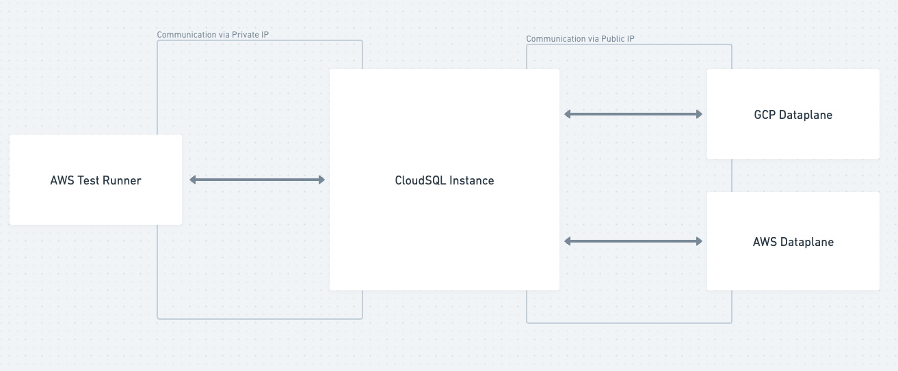

# airbyte-test-utils

Shared Java code for executing TestContainers and other helpers.

## Stage databases setup

When we run acceptance tests on an environment that is not `stage`, a test container will be used for each connector that requires a database. Each test container will be used for only one test case, and it will be deleted once the test case completes.

When we run acceptance tests on stage, things are slightly more complex, but we try to have the same behavior. Instead of using a test container for each connector that requires a database, we will use a CloudSQL database for each connector. Similarly to the test containers, each CloudSQL database will be used for only one test case, and it will be deleted once the test case completes.

It's important to understand how are the different components communicating when running on stage.

- It is possible to communicate with the `CloudSQL Instance` from both private IP and public ip
- One same `CloudSQL Instance` is use for all the tests, but each test case will create their own databases inside this instance.
- We run the acceptance tests from a `AWS Test Runner` (EC2 instances), which are behind Tailscale, so they can communicate with the CloudSQL instance using its private IP. We need to be able to access the CloudSQL instance from these test runners since the tests will access these databases to validate their content.
- The only IPs that are allowed to connect to the CloudSQL instance via its public IP are the ones that belong to stage Dataplanes (both `GCP Dataplane` and `AWS Dataplane`). Note that this is not a workaround for the sake of our tests, this is the same setup that real users have.

