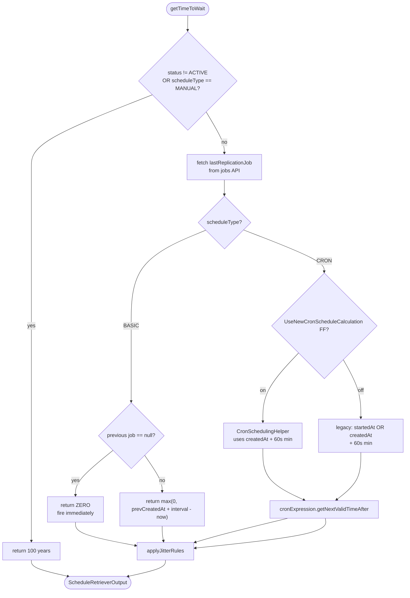
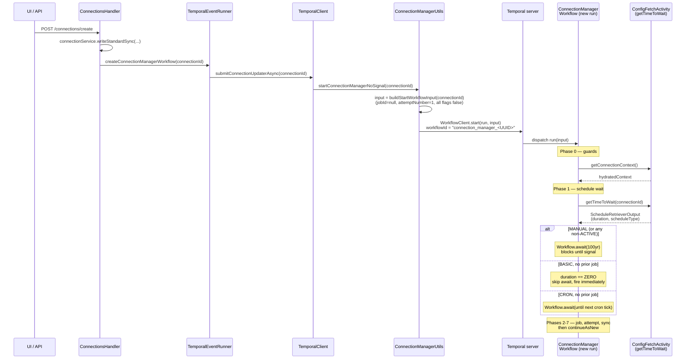
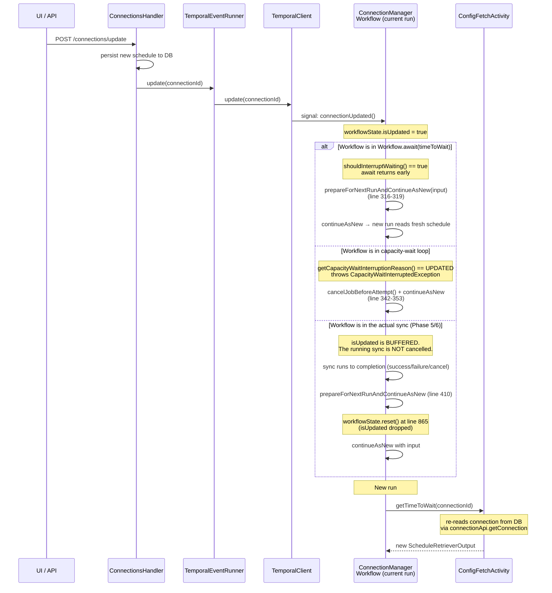

# Connection Job Scheduling

This document describes how Airbyte schedules sync jobs for a connection. The scheduling is implemented inside the long-running `ConnectionManagerWorkflow` Temporal workflow, with the per-mode wait-time math delegated to the `ConfigFetchActivity.getTimeToWait` activity.

It covers:

- The three supported schedule modes (`MANUAL`, `BASIC`, `CRON`) and the exact wait-time formula for each.
- What happens at connection creation (how the workflow is started and how the first run is dispatched).
- What happens when the schedule (or any other connection config) is updated.
- How scheduling interacts with retries, capacity gating, resets, manual syncs, pauses, and load-shedding.
- Operational gotchas and audit signals.

The two source files are:

- [`oss/airbyte-workers/src/main/kotlin/io/airbyte/workers/temporal/scheduling/ConnectionManagerWorkflowImpl.kt`](../../oss/airbyte-workers/src/main/kotlin/io/airbyte/workers/temporal/scheduling/ConnectionManagerWorkflowImpl.kt) (~1660 lines) — the workflow.
- [`oss/airbyte-workers/src/main/kotlin/io/airbyte/workers/temporal/scheduling/activities/ConfigFetchActivityImpl.kt`](../../oss/airbyte-workers/src/main/kotlin/io/airbyte/workers/temporal/scheduling/activities/ConfigFetchActivityImpl.kt) (~336 lines) — the activity that computes per-mode wait times.

> A more comprehensive treatment of the surrounding Temporal architecture (`SyncWorkflowV2`, retry manager, capacity gating, error handling) lives in [temporal-orchestration.md](temporal-orchestration.md). This document focuses specifically on **scheduling** end-to-end.

---

## Contents

1. [Mental Model](#mental-model)
2. [Schedule Modes](#schedule-modes)
   - [`MANUAL`](#manual)
   - [`BASIC`](#basic)
   - [`CRON`](#cron)
     - [CRON updates are NOT strict scheduling](#cron-updates-are-not-strict-scheduling)
   - [Status overrides (`INACTIVE` / `DEPRECATED`)](#status-overrides-inactive--deprecated)
   - [Jitter and scheduling noise](#jitter-and-scheduling-noise)
3. [First Run: Connection Creation](#first-run-connection-creation)
4. [Schedule Updates](#schedule-updates)
5. [Interactions With Other Workflow States](#interactions-with-other-workflow-states)
   - [Retries](#retries)
   - [Capacity gating](#capacity-gating)
   - [Manual sync (`submitManualSync`)](#manual-sync-submitmanualsync)
   - [Reset (`resetConnection` and `resetConnectionAndSkipNextScheduling`)](#reset-resetconnection-and-resetconnectionandskipnextscheduling)
   - [Cancel / delete](#cancel--delete)
   - [Load-shedding](#load-shedding)
6. [Edge Cases and Gotchas](#edge-cases-and-gotchas)
7. [Operational Reference](#operational-reference)
   - [Signal cheatsheet](#signal-cheatsheet)
   - [Constants and tuning knobs](#constants-and-tuning-knobs)
   - [Workflow ID](#workflow-id)

---

## Mental Model

There is **one** `ConnectionManagerWorkflow` per connection, with workflow ID `connection_manager_<connectionId>`. It is started once when the connection is created and lives forever via `Workflow.continueAsNew` — each cycle processes one job (one attempt of one sync) and then restarts.

The basic loop is:

```
loop forever (via continueAsNew):
    1. fetch fresh connection config + compute wait time   (configFetchActivity.getTimeToWait)
    2. Workflow.await(waitTime) { signal-triggered? }      (the schedule wait)
    3. create job, wait for capacity, create attempt       (job becomes RUNNING)
    4. run pre-sync checks + SyncWorkflowV2                (the actual sync)
    5. report success / failure / cancellation
    6. continueAsNew → back to step 1
```

The schedule lives in the database (on the `connection` table, columns `schedule_type` and `schedule_data`). The workflow does **not** cache it across cycles — it re-reads it via `getTimeToWait` at the top of every cycle (`ConnectionManagerWorkflowImpl.kt:295`). This is what makes schedule updates effective: a `continueAsNew` is enough to pick up the new schedule.

The mapping from "user-facing schedule" to "wait duration" is computed entirely inside the activity, not the workflow. The workflow itself only sees the resulting `Duration` and the `ConnectionScheduleType` enum value (used downstream by capacity gating).

---

## Schedule Modes

The `ConnectionScheduleType` enum has exactly three values, defined in the OpenAPI spec at [`oss/airbyte-api/server-api/src/main/openapi/config.yaml:15833-15839`](../../oss/airbyte-api/server-api/src/main/openapi/config.yaml) and generated to `ConnectionScheduleType.kt:27-36`:

| Enum value | Wire value | User-facing |
|------------|------------|-------------|
| `MANUAL`   | `"manual"` | No schedule. Runs only on UI/API trigger. |
| `BASIC`    | `"basic"`  | Fixed interval (every N minutes/hours/days/weeks/months). |
| `CRON`     | `"cron"`   | Quartz cron expression with timezone. |

The wait-time computation lives in `ConfigFetchActivityImpl.getTimeToWaitFromScheduleType` (`ConfigFetchActivityImpl.kt:160-237`). The high-level decision tree:

<details>
<summary><strong>Decision tree diagram</strong></summary>



</details>

### `MANUAL`

A `MANUAL` connection has **no schedule at all**. It runs only when explicitly triggered by the user (or by an automated `submitManualSync()` signal from elsewhere in the platform). The "wait until next scheduled run" duration is a 100-year sentinel that effectively never elapses on its own.

**Does the first run fire automatically?** No. The workflow is started at connection-create time, immediately enters `Workflow.await(100 years) { shouldInterruptWaiting() }`, and sits there. Nothing runs until a signal arrives.

**Formula** (`ConfigFetchActivityImpl.kt:165-168`):

```kotlin
if (connectionRead.scheduleType == ConnectionScheduleType.MANUAL || connectionRead.status != ConnectionStatus.ACTIVE) {
  // Manual syncs wait for their first run
  return Duration.ofDays((100 * 365).toLong())
}
```

The workflow proceeds to `Workflow.await(100 years) { shouldInterruptWaiting() }` at `ConnectionManagerWorkflowImpl.kt:305-307`, where `shouldInterruptWaiting()` returns `true` if any of these flags are set: `isSkipScheduling`, `isDeleted`, `isUpdated`, `isCancelled` (line 848-849).

**Behavior by event:**

| Event | Behavior |
|-------|----------|
| **First run after connection creation** | No automatic run. Workflow enters the 100-year wait. |
| **Schedule update via `connectionUpdated()`** | `isUpdated` flips, the 100-year wait exits early, `continueAsNew` is called, the new run re-reads the connection. If still `MANUAL` → re-enters the 100-year wait. If now `BASIC` → behavior of [BASIC](#basic) applies (the previous manual job, if any, anchors the next-run calculation). If now `CRON` → behavior of [CRON](#cron) applies. |
| **Manual sync (`submitManualSync()`)** | `isSkipScheduling` flips, the wait exits, the run proceeds straight to job creation (no scheduling delay). The job is marked as not-scheduler-triggered. **If a sync is already running, the signal is silently dropped** (`ConnectionManagerWorkflowImpl.kt:761-764`). |
| **Reset (`resetConnection`)** | `isSkipScheduling` flips, the wait exits, the next run executes a reset job immediately. |
| **Retry after failure** | The workflow runs with `fromFailure = true`. The schedule wait is replaced by `resolveBackoff()` (see [Retries](#retries)). For MANUAL this means retries do not wait the 100-year sentinel — they wait the retry backoff. |
| **Pause (`status` → `INACTIVE`)** | Already-equivalent to MANUAL; the 100-year wait continues. |
| **Delete (`deleteConnection`)** | `isDeleted` flips, wait exits, workflow terminates without `continueAsNew`. |

> **Note:** `Workflow.await` does not actually consume 100 years of timer budget — Temporal handles it as an indefinite wait that the SDK and server can resume cheaply. The 100-year number is just a "never" sentinel.

### `BASIC`

A `BASIC` connection runs on a fixed interval — every N minutes, hours, days, weeks, or months. The interval is measured from the **last replication job's `createdAt`**, including cancelled and manually-triggered jobs. As a result, **a manual sync resets the interval clock**: the next scheduled run is `interval` after the manual sync's `createdAt`, not after the previous scheduled run.

**Does the first run fire automatically?** Yes, immediately. A brand-new BASIC connection has no prior job, so `getTimeToWait` returns `Duration.ZERO` and the workflow skips the schedule wait entirely (the `!timeToWait.isZero` guard at `ConnectionManagerWorkflowImpl.kt:305`).

A `BASIC` schedule is `{ units: Long, timeUnit: MINUTES|HOURS|DAYS|WEEKS|MONTHS }` (the `ConnectionScheduleDataBasicSchedule` model, generated from `config.yaml:15851-15858`). The conversion to seconds is in `ConfigFetchActivityImpl.kt:312-321`:

| `timeUnit` | Seconds per unit |
|------------|------------------|
| `MINUTES`  | 60               |
| `HOURS`    | 3600             |
| `DAYS`     | 86 400           |
| `WEEKS`    | 86 400 × 7       |
| `MONTHS`   | 86 400 × 30 (**not** calendar months — fixed 30-day rolling) |

**Formula** (`ConfigFetchActivityImpl.kt:173-184`):

```kotlin
if (connectionRead.scheduleType == ConnectionScheduleType.BASIC) {
  if (previousJobOptional.job == null) {
    // Basic schedules don't wait for their first run.
    return Duration.ZERO
  }
  val prevRunStart = previousJobOptional.job!!.createdAt
  val nextRunStart = prevRunStart + getIntervalInSecond(connectionRead.scheduleData!!.basicSchedule!!)
  val timeToWait = Duration.ofSeconds(max(0, nextRunStart - currentSecondsSupplier.get()!!))
  return timeToWait
}
```

The "previous job" comes from `airbyteApiClient.jobsApi.getLastReplicationJobWithCancel(...)` (line 171), which returns the most recent replication job of any kind — scheduled, manual, retry, or cancelled.

**Behavior by event:**

| Event | Behavior |
|-------|----------|
| **First run after connection creation** | Fires **immediately** (`Duration.ZERO`). No initial wait. |
| **Subsequent scheduled runs** | Wait = `max(0, prevJob.createdAt + interval - now)`. If the previous run took longer than the interval, the next run fires immediately on the following cycle (no make-up runs — exactly one fires). |
| **Schedule update via `connectionUpdated()`** | The current wait exits early, `continueAsNew` re-reads the connection with the new interval. The next-run calculation uses the new interval against the most recent job's `createdAt`. **Example:** schedule was "every 1 hour" with last run at 12:00; user updates to "every 30 minutes" at 12:15 — the next run becomes `max(0, 12:00 + 30min - 12:15)` = 12:30 (15 minutes from the update). |
| **Manual sync (`submitManualSync()`)** | Fires immediately. **The next scheduled run shifts** because the manual job becomes the new "previous job" — its `createdAt` is the new anchor. **Example:** schedule "every 1 hour" with last scheduled at 12:00 (next would be 13:00); user manually triggers at 12:30 → the next scheduled run becomes 13:30, not 13:00. There is no concept of "still due at 13:00 anyway." |
| **Reset (`resetConnection`)** | Behaves like a manual sync from the scheduling standpoint — the reset job's `createdAt` becomes the new anchor, shifting the next scheduled run accordingly. |
| **Retry after failure** | `fromFailure = true` → wait = `resolveBackoff()` (see [Retries](#retries)), not the schedule interval. Backoff can exceed the interval. The retry job's `createdAt` (when it eventually fires) anchors the next scheduled run, so a long backoff also shifts the schedule. |
| **Pause (`status` → `INACTIVE`)** | The next `getTimeToWait` falls into the status-override branch and returns 100 years ([Status overrides](#status-overrides-inactive--deprecated)). |
| **Delete (`deleteConnection`)** | Workflow terminates. |

Key properties:

- **The interval is measured from `createdAt`, not from job end time.** A 5-minute interval with a sync that takes 8 minutes does not skip an interval — the next run simply fires immediately when the in-progress run ends and the workflow `continueAsNew`s.
- **Cancelled and manual jobs count as the "previous job"** because `getLastReplicationJobWithCancel` includes them. There is no notion of "next scheduled run independent of the last actual run."
- **`MONTHS` is 30 days rolling, not calendar months.** Use `CRON` if you need calendar-aligned monthly runs (e.g. "1st of every month at midnight").

### `CRON`

A `CRON` connection runs at the next valid time matched by a Quartz cron expression, evaluated in a specified timezone. Unlike `BASIC`, a manual sync **does not shift the cron schedule** — the next scheduled run is still the next cron tick after a 60-second floor measured from the manual job. The cron expression is the source of truth; the previous-job timestamp only enforces a minimum gap to prevent double-firing within the same minute.

**Does the first run fire automatically?** Yes, but **not immediately** — the first run fires at the next cron tick after creation. A brand-new CRON connection has no prior job, so `earliestNextRun = now`, and `getNextValidTimeAfter(now)` returns the next matching cron time.

A `CRON` schedule is `{ cronExpression: String, cronTimeZone: String }`. The expression is parsed with Quartz `org.quartz.CronExpression` and the timezone via Joda `DateTimeZone.forID(...)` (`ConfigFetchActivityImpl.kt:187-190`). A bad expression throws `DateTimeException` from inside the activity, which propagates as a workflow failure.

There are two code paths gated by the `UseNewCronScheduleCalculation` feature flag.

**New path (flag on), via `CronSchedulingHelper.getNextRuntimeBasedOnPreviousJobAndSchedule`** ([`oss/airbyte-workers/src/main/kotlin/io/airbyte/workers/helpers/CronSchedulingHelper.kt:22-40`](../../oss/airbyte-workers/src/main/kotlin/io/airbyte/workers/helpers/CronSchedulingHelper.kt)):

```kotlin
val earliestNextRunSeconds =
  if (priorJobRead == null) currentSecondsSupplier.get()
  else priorJobRead.createdAt + MIN_CRON_INTERVAL_SECONDS  // 60s
val earliestNextRun = Date(earliestNextRunSeconds * 1000)
val nextRunStartDate = cronExpression.getNextValidTimeAfter(earliestNextRun)
return Duration.ofSeconds(max(0, nextRunStartDate.time / 1000 - now))
```

**Legacy path (flag off)** (`ConfigFetchActivityImpl.kt:207-231`): identical structure but uses `previousJob.startedAt` if present, else `previousJob.createdAt`. Both paths enforce the same 60-second minimum (`MIN_CRON_INTERVAL_SECONDS`).

**Behavior by event:**

| Event | Behavior |
|-------|----------|
| **First run after connection creation** | Workflow waits until the **next cron tick** after creation. Not immediate. |
| **Subsequent scheduled runs** | Wait = `cronExpression.getNextValidTimeAfter(prevJob.createdAt + 60s) - now`. The 60-second floor prevents two runs from being computed for the same scheduled minute. |
| **Schedule update via `connectionUpdated()`** | Wait exits, `continueAsNew` re-reads the connection with the new cron expression and/or timezone. The next run is `cronExpression.getNextValidTimeAfter(prevJob.createdAt + 60s)` — i.e. the next valid time of the **new** expression starting from the **old** previous-job anchor. If that time has already passed (because the new expression would have fired sometime between the previous job and now), the wait clamps to `0` and the workflow **fires immediately as a one-time catch-up**, then resumes on the new schedule from there. See [CRON updates are NOT strict scheduling](#cron-updates-are-not-strict-scheduling). |
| **Manual sync (`submitManualSync()`)** | Fires immediately. **The cron schedule does NOT shift in the general case** — the next scheduled run is `cronExpression.getNextValidTimeAfter(manualJob.createdAt + 60s)`, which is typically the same cron tick that would have fired anyway. **Example:** cron `0 0 * * * ?` (top of every hour), last scheduled at 12:00 (next would be 13:00); user manually triggers at 12:30 → next earliest is 12:31, next cron tick after 12:31 is 13:00 (unchanged). **Edge case:** if the manual sync lands within 60 seconds before the next scheduled tick, that tick is **skipped** because `manual.createdAt + 60s` advances past it. E.g. cron every 30 min, scheduled at 12:30; manual at 12:29:30 → earliest = 12:30:30 → next tick = 13:00 (the 12:30 tick is lost). |
| **Reset (`resetConnection`)** | Same as manual sync — the reset job's `createdAt` enforces the 60-second floor; the next scheduled tick is unchanged unless within 60s. |
| **Retry after failure** | `fromFailure = true` → wait = `resolveBackoff()`. Backoff can push the retry past the next cron tick. When the retry eventually runs, its `createdAt` becomes the new anchor and the *next* scheduled run is the next cron tick after that — which may skip ticks if the retry was far in the future. |
| **Pause (`status` → `INACTIVE`)** | 100-year wait per [Status overrides](#status-overrides-inactive--deprecated). |
| **Delete (`deleteConnection`)** | Workflow terminates. |

#### CRON updates are NOT strict scheduling

Airbyte's CRON scheduling is **not strict**. When the cron expression is updated (or when an updated expression first runs), the next-run calculation is anchored on `prevJob.createdAt + 60s`, **not** on `now`. If the new expression would have fired one or more times between the previous job and the current time, the wait collapses to `0` and the workflow fires **immediately** as a one-time catch-up — even if the current moment is nowhere near a valid tick of the new expression. After that catch-up fire, the anchor moves to the catch-up job's `createdAt` and the schedule re-aligns to the new expression on the cycle after.

This is a consequence of the formula in `CronSchedulingHelper.kt:22-40` and `ConfigFetchActivityImpl.kt:207-231`:

```kotlin
val earliestNextRunSeconds = priorJobRead.createdAt + MIN_CRON_INTERVAL_SECONDS
val nextRunStartDate = cronExpression.getNextValidTimeAfter(Date(earliestNextRunSeconds * 1000))
return Duration.ofSeconds(max(0, nextRunStartDate.time / 1000 - now))
```

`getNextValidTimeAfter` is computed against the *old* anchor, then `max(0, …)` clamps the result. Once that clamp triggers, the workflow loses any alignment with the cron expression for that one run.

**Worked examples:**

| Old cron | Last job | New cron (set at) | Calculation | Resulting behavior |
|----------|----------|-------------------|-------------|--------------------|
| `0 0 * * *` (daily at 00:00) | today 00:00 | `0 * * * *` (hourly at :00), set at 14:00 | next `:00` after 00:01 = 01:00 (past) → clamp to 0 | **Fires immediately at 14:00**, not at 15:00. Next run after that is 15:00 (back on schedule). |
| `0 0 * * 0` (weekly Sun 00:00) | last Sunday 00:00 | `0 9 * * *` (daily at 09:00), set Wednesday 14:00 | next `09:00` after last-Sunday + 60s = Monday 09:00 (past) → clamp to 0 | **Fires immediately Wed 14:00**, then next run Thu 09:00. The Mon/Tue/Wed 09:00 ticks of the new expression are **not** caught up — only one catch-up fire happens. |
| `0 * * * *` (hourly) | 12:00 | `30 * * * *` (hourly at :30), set at 12:15 | next `:30` after 12:01 = 12:30 (future) → wait 15 min | Fires at 12:30 as expected. No catch-up; this is a normal on-schedule transition. |
| `*/30 * * * *` (every 30 min) | 12:30 | `0 * * * *` (hourly at :00), set at 12:45 | next `:00` after 12:31 = 13:00 (future) → wait 15 min | Fires at 13:00. Smooth transition. |

**Practical implications:**

- **Switching to a more-frequent cron mid-day:** expect an immediate run, regardless of whether the current minute is a valid tick of the new expression.
- **Switching to a less-frequent cron when the prior job is far in the past** (e.g. the connection was paused for weeks): also expect an immediate run on first wake, then alignment.
- **Long pauses or long retries are equivalent to a stale anchor.** If a connection was `INACTIVE` for two weeks and is re-activated, the first run is computed from the *original* prior job, which is two weeks old — so anything more frequent than every-two-weeks will trigger an immediate catch-up fire.
- **Only one catch-up fire happens, not one per missed tick.** Even if the new expression would have fired 24 times since the prior job, only a single immediate run is scheduled. The next-next run is then on the new schedule.

If you need strict cron alignment (no immediate catch-up on update or wake), the only workaround today is to manually trigger an extra sync (or wait through one catch-up cycle) so that the prior-job anchor advances to a recent time before the next computed run.

#### Other key properties

- **First run waits for the next cron tick.** A brand-new CRON connection does not fire immediately (unlike BASIC). This is sometimes surprising to users who expect to see a sync run shortly after creation.
- **60-second minimum gap between cron fires** (`CronSchedulingHelper.kt:20` and `ConfigFetchActivityImpl.kt:327`). Cron has 1-minute resolution; without this guard a run that completes in less than a minute would re-fire immediately for the same scheduled minute.
- **Manual triggers do not realign the schedule.** Unlike BASIC, the cron expression is the source of truth — manual runs are "extra" runs, not "the schedule restarted from here."
- **Manual triggers can skip a tick** if landed within the 60-second floor before that tick.
- **DST is handled by Quartz.** `cronExpression.timeZone = timeZone` (line 190) is set before evaluation, so cron expressions like `0 30 2 * * ?` over a DST spring-forward are handled by Quartz's rules.
- **Skewed `startedAt` vs `createdAt` (legacy only).** The legacy path uses `startedAt` when present. If a job spent time queued, `startedAt > createdAt` and the next earliest run is pushed later than the user might expect. The new helper always uses `createdAt`.

### Status overrides (`INACTIVE` / `DEPRECATED`)

The very first check in `getTimeToWaitFromScheduleType` (`ConfigFetchActivityImpl.kt:165-168`) is:

```kotlin
if (connectionRead.scheduleType == ConnectionScheduleType.MANUAL || connectionRead.status != ConnectionStatus.ACTIVE) {
  return Duration.ofDays((100 * 365).toLong())
}
```

So a non-ACTIVE connection of any schedule type behaves like `MANUAL` for scheduling purposes — the workflow sits in a 100-year `Workflow.await` until a signal (typically `connectionUpdated()` from re-activation) wakes it.

`ConnectionStatus` values come from `config.yaml` and are `ACTIVE`, `INACTIVE`, `DEPRECATED`. Re-activation (`INACTIVE` → `ACTIVE`) goes through the standard update path in [Schedule Updates](#schedule-updates).

### Jitter and scheduling noise

After `getTimeToWaitFromScheduleType` returns, `applyJitterRules` (`ConfigFetchActivityImpl.kt:129-149`) is called. There are two mutually exclusive modes:

- **`AddSchedulingJitter` feature flag is on:** delegate to `ScheduleJitterHelper.addJitterBasedOnWaitTime` ([`oss/airbyte-workers/src/main/kotlin/io/airbyte/workers/helpers/ScheduleJitterHelper.kt:29-95`](../../oss/airbyte-workers/src/main/kotlin/io/airbyte/workers/helpers/ScheduleJitterHelper.kt)). Bucketed jitter based on `AirbyteWorkerConfig.connection.scheduleJitter` (HIGH / MEDIUM / LOW / VERY_LOW thresholds and amounts). **CRON gets only positive jitter** (`ScheduleJitterHelper.kt:46-49`); BASIC and MANUAL get symmetric jitter around zero. The CRON asymmetry is deliberate to avoid double-firing for the same scheduled minute (a negative jitter could complete the sync before the original scheduled time, causing the next computed wait to be very short).
- **`AddSchedulingJitter` feature flag is off:** legacy `addSchedulingNoiseForAllowListedWorkspace` (`ConfigFetchActivityImpl.kt:239-258`). Only applies to a hardcoded allow-list of three workspace UUIDs (`SCHEDULING_NOISE_WORKSPACE_IDS`) and only to CRON connections. Adds a random `[0, 15) minutes` plus 1 second.

If neither applies, the wait time is returned unmodified.

---

## First Run: Connection Creation

This is the path from "user creates a connection in the UI" to "first sync starts running."

<details>
<summary><strong>Connection-creation sequence diagram</strong></summary>



</details>

### The workflow is started unconditionally at connection-create time

`ConnectionsHandler.createConnection` calls `eventRunner.createConnectionManagerWorkflow(connectionId)` immediately after the connection row is written ([`oss/airbyte-commons-server/src/main/kotlin/io/airbyte/commons/server/handlers/ConnectionsHandler.kt:638-650`](../../oss/airbyte-commons-server/src/main/kotlin/io/airbyte/commons/server/handlers/ConnectionsHandler.kt)). The call is **inside a try/catch that rolls the connection back if the workflow fails to start**:

```kotlin
connectionService.writeStandardSync(standardSync)
trackNewConnection(standardSync)
try {
  log.info { "Starting a connection manager workflow for connectionId $connectionId" }
  eventRunner.createConnectionManagerWorkflow(connectionId)
} catch (e: Exception) {
  log.error(e) { "Start of the connection manager workflow failed; deleting connectionId $connectionId" }
  deleteConnection(connectionId)
  throw e
}
```

There is **no status check**. A connection created with `status = INACTIVE` still gets its workflow started — the workflow simply enters the 100-year wait ([Status overrides](#status-overrides-inactive--deprecated)) and stays idle.

### The chain: API → handler → temporal client → `WorkflowClient.start`

| Step | File | Line |
|------|------|------|
| Internal API endpoint | [`oss/airbyte-server/src/main/kotlin/io/airbyte/server/apis/controllers/ConnectionApiController.kt`](../../oss/airbyte-server/src/main/kotlin/io/airbyte/server/apis/controllers/ConnectionApiController.kt) | (`@Post("/create")` route) |
| Handler | [`oss/airbyte-commons-server/src/main/kotlin/io/airbyte/commons/server/handlers/ConnectionsHandler.kt`](../../oss/airbyte-commons-server/src/main/kotlin/io/airbyte/commons/server/handlers/ConnectionsHandler.kt) | `638-650` |
| EventRunner | [`oss/airbyte-commons-server/src/main/kotlin/io/airbyte/commons/server/scheduler/TemporalEventRunner.kt`](../../oss/airbyte-commons-server/src/main/kotlin/io/airbyte/commons/server/scheduler/TemporalEventRunner.kt) | `20-23` |
| TemporalClient | [`oss/airbyte-commons-temporal/src/main/kotlin/io/airbyte/commons/temporal/TemporalClient.kt`](../../oss/airbyte-commons-temporal/src/main/kotlin/io/airbyte/commons/temporal/TemporalClient.kt) | `603-628` |
| ConnectionManagerUtils | [`oss/airbyte-commons-temporal/src/main/kotlin/io/airbyte/commons/temporal/ConnectionManagerUtils.kt`](../../oss/airbyte-commons-temporal/src/main/kotlin/io/airbyte/commons/temporal/ConnectionManagerUtils.kt) | `171-177` |
| Input builder | [`oss/airbyte-commons-temporal/src/main/kotlin/io/airbyte/commons/temporal/TemporalWorkflowUtils.kt`](../../oss/airbyte-commons-temporal/src/main/kotlin/io/airbyte/commons/temporal/TemporalWorkflowUtils.kt) | `32-44` |

`TemporalClient.submitConnectionUpdaterAsync` waits up to **60 seconds** for the workflow to become reachable after `WorkflowClient.start` returns, so the create-connection API call blocks until the workflow is actually live.

### The initial `ConnectionUpdaterInput`

`TemporalWorkflowUtils.buildStartWorkflowInput(connectionId)` produces:

| Field | Initial value | Purpose |
|-------|--------------|---------|
| `connectionId` | the new connection | Identifies which connection this workflow manages. |
| `jobId` | `null` | No carry-over job; the first run creates a fresh one. |
| `attemptId` | `null` | — |
| `fromFailure` | `false` | The first run is not a retry. |
| `attemptNumber` | `1` | 1-based on this input (note: `WorkflowInternalState.attemptNumber` is 0-based — see comment at `ConnectionManagerWorkflowImpl.kt:501-503`). |
| `workflowState` | `null` | Only populated in test cases. |
| `resetConnection` | `false` | — |
| `fromJobResetFailure` | `false` | — |
| `skipScheduling` | `false` | The first run goes through the normal schedule wait. |

### What the first run actually does, per schedule type

| Schedule | First-run behavior |
|----------|--------------------|
| `MANUAL` | `getTimeToWait` returns 100 years → `Workflow.await(100yr) { signal? }` → sits there indefinitely. The first sync only ever runs when `submitManualSync()` (or another wake signal) is sent. |
| `BASIC` | `getTimeToWait` returns `Duration.ZERO` (previous job is `null`) → the `!timeToWait.isZero` guard at line 305 is false → the wait is skipped → the workflow proceeds straight to job creation. The first BASIC sync **fires immediately**. |
| `CRON` | `getTimeToWait` returns `cronExpression.getNextValidTimeAfter(now) - now` → the workflow waits until the next matching cron tick. The first CRON sync fires at the next scheduled time, **not** immediately. |

### Status `INACTIVE` at creation

If a connection is created with `status = INACTIVE` (or `DEPRECATED`), `getTimeToWait` returns 100 years regardless of schedule type. The workflow is started and parked. When the connection is later activated via an update, that update sends a `connectionUpdated()` signal which wakes the workflow (see [Schedule Updates](#schedule-updates)).

---

## Schedule Updates

Any change to the connection — schedule type, cron expression, basic interval, status (pause/unpause), and many non-schedule fields — flows through `ConnectionsHandler.updateConnection`, which calls `eventRunner.update(connectionId)`, which signals `connectionUpdated()` on the workflow.

<details>
<summary><strong>Schedule-update sequence diagram</strong></summary>



</details>

### The signal handler

`ConnectionManagerWorkflowImpl.connectionUpdated()` (`ConnectionManagerWorkflowImpl.kt:794-796`) is intentionally minimal:

```kotlin
override fun connectionUpdated() {
  workflowState.isUpdated = true
}
```

It does nothing else. No activity calls, no schedule recomputation, no `Workflow.cancel`. The signal just flips a bit.

### Where `isUpdated` is read

A `grep` over `ConnectionManagerWorkflowImpl.kt` for `isUpdated` returns exactly **three** read sites (plus the assignment at line 795):

| Line | Context | Effect |
|------|---------|--------|
| `849` | `shouldInterruptWaiting()` — the predicate of `Workflow.await(timeToWait) { ... }` at line 306 | The schedule wait exits early. |
| `316-319` | Right after `Workflow.await` returns | `prepareForNextRunAndContinueAsNew(input)` → `continueAsNew`. |
| `1210` | Inside `getCapacityWaitInterruptionReason()` in the capacity-wait poll loop (line 1131-1182) | Returns `CapacityWaitInterruptionReason.UPDATED` → `throwIfCapacityWaitInterrupted()` throws → caught at line 342-353 → `cancelJobBeforeAttempt` + `resetNewConnectionInput` + `continueAsNew`. |

That's it. There is **no** code path that reads `isUpdated` once the actual sync (`runChildWorkflowV2` at `ConnectionManagerWorkflowImpl.kt:391-397`) has been invoked. The signal is silently buffered until the sync finishes, at which point `prepareForNextRunAndContinueAsNew` runs anyway (line 410) and the next run picks up the fresh schedule.

> Contrast: `cancelJob()` (line 770-783), `resetConnection()` (line 799-812), and `resetConnectionAndSkipNextScheduling()` (line 814-828) explicitly call `cancelSyncChildWorkflow()` to abort an in-flight sync. `connectionUpdated()` deliberately does not.

### Why the new schedule is picked up

After `continueAsNew`, the new run starts at `run(input)` (line 158) and unconditionally calls `getTimeTilScheduledRun` at line 295, which dispatches `configFetchActivity.getTimeToWait(...)`. That activity, in turn, re-reads the connection from the API:

```kotlin
// ConfigFetchActivityImpl.kt:81-87
val connectionIdRequestBody = ConnectionIdRequestBody(input.connectionId!!)
val connectionRead = airbyteApiClient.connectionApi.getConnection(connectionIdRequestBody)
val workspaceId = airbyteApiClient.workspaceApi.getWorkspaceByConnectionId(connectionIdRequestBody).workspaceId
val timeToWait = getTimeToWaitFromScheduleType(connectionRead, input.connectionId!!, workspaceId)
val timeToWaitWithSchedulingJitter = applyJitterRules(timeToWait, input.connectionId!!, connectionRead.scheduleType, workspaceId)
return ScheduleRetrieverOutput(timeToWaitWithSchedulingJitter, connectionRead.scheduleType)
```

There is no in-workflow caching of the schedule — every cycle reads it fresh.

### Pause / unpause (status changes)

A status update (`ACTIVE` ↔ `INACTIVE`) goes through the same `updateConnection` handler and ends with a `connectionUpdated()` signal. The behavior is:

- **`ACTIVE` → `INACTIVE`:** signal flips `isUpdated` → if not currently syncing, the await exits early, `continueAsNew` runs, and the new run's `getTimeToWait` returns 100 years (the `status != ACTIVE` guard at `ConfigFetchActivityImpl.kt:165`). The workflow parks.
- **`INACTIVE` → `ACTIVE`:** same signal flow. The new run's `getTimeToWait` returns the real schedule-derived wait. The workflow resumes normal scheduling.
- **Auto-disable on repeated failure** (`ConnectionServiceImpl.disableConnections`) also calls `eventRunner.update(connectionId)`, so the same wake-up signal applies.

> If the connection is **currently syncing** when status flips to `INACTIVE`, the running sync is not cancelled — `connectionUpdated` does not interrupt running syncs. The pause only takes effect on the next cycle. There is, however, a separate guard inside `SyncWorkflowV2` that aborts before the replication phase if the connection's status is `INACTIVE` or `LOCKED` at that moment.

### What is NOT covered by `connectionUpdated`

- **Schedule deletion / re-creation of the connection.** Deleting the connection sends `deleteConnection()` (a separate signal) which sets `isDeleted = true` and terminates the workflow without `continueAsNew`. A subsequent re-create starts a fresh workflow with a fresh workflow ID.
- **Self-heal restart.** If a workflow ever ends up in a `FAILED` Temporal state without a live counterpart (non-determinism, crash, etc.), the `SelfHealTemporalWorkflows` cron in [`oss/airbyte-cron/`](../../oss/airbyte-cron/) restarts a fresh `ConnectionManagerWorkflow` for the connection within 10 seconds. The new workflow uses `buildStartWorkflowInput` again — same as connection creation — so it picks up the current schedule from the DB.

---

## Interactions With Other Workflow States

The schedule wait is one of several "the workflow is paused waiting for something" states. Each interacts with scheduling differently.

### Retries

Retries bypass the schedule. When the previous run failed and is being retried, the workflow re-enters with `connectionUpdaterInput.fromFailure = true` (`ConnectionManagerWorkflowImpl.kt:526`). The wait-time selection at line 297-303 then chooses **backoff time instead of schedule time**:

```kotlin
val timeToWait =
  if (connectionUpdaterInput.fromFailure) {
    // note this can fail the job if the backoff is longer than the scheduled time to wait
    resolveBackoff()
  } else {
    timeTilScheduledRun
  }
```

`resolveBackoff()` (line 1477-1487) consults the `RetryManager`'s `BackoffPolicy` (exponential, defaults 10s → 1h cap, separate curves for complete-failure vs partial-failure retries) and returns the backoff `Duration`. If `RetryManager` hydration failed, it falls back to `Duration.ZERO` (immediate retry, capped by `maxAttempt`).

The comment in the code is honest: **the backoff can be longer than the scheduled-run interval**. If a connection is on a 5-minute BASIC schedule and the backoff for the next retry is 40 minutes, the workflow will wait 40 minutes (not 5) before retrying that attempt. The next normal scheduled run is implicitly delayed.

### Capacity gating

When the platform is enforcing data-worker capacity (`EnforceDataWorkerCapacity` feature flag on, `capacity_check` version tag set), the workflow can spend time in a polling loop **after job creation but before attempt creation**. This loop interacts with the schedule via two timeouts (see `waitForCapacityIfNeeded`, `ConnectionManagerWorkflowImpl.kt:1076-1183`):

- **Scheduled connections (BASIC, CRON):** the cutoff is `nextScheduledRunMs` (line 1192-1203), computed by calling `getScheduleInfo` again to get the time-to-wait for the **next** scheduled run. If the capacity wait exceeds this duration, the workflow throws `CapacityWaitExceededException` with reason `"Job cancelled: next scheduled sync time reached while waiting for Data Worker capacity"`, cancels the queued job, and `continueAsNew`s. The intent is that if a connection can't get capacity before its next scheduled run, skip this run and try next time.
- **`MANUAL` connections:** the cutoff is `MANUAL_CAPACITY_WAIT_TIMEOUT = Duration.ofHours(8)` (line 1654, used at line 1185-1190). A manual sync that has been queued for 8 hours is cancelled with reason `"Job cancelled: manual sync waited 8 hours for Data Worker capacity"`.

The capacity-wait loop also checks the four workflow-state flags every poll (default poll interval `Duration.ofMinutes(1)`, `CAPACITY_CHECK_POLL_INTERVAL` at line 1653) via `getCapacityWaitInterruptionReason` (line 1205-1212). If `isDeleted`, `isCancelledForReset`, `isCancelled`, or `isUpdated` is set during the capacity wait, the queued job is cancelled and the workflow `continueAsNew`s.

### Manual sync (`submitManualSync`)

`submitManualSync()` (`ConnectionManagerWorkflowImpl.kt:760-767`):

```kotlin
override fun submitManualSync() {
  if (workflowState.isRunning) {
    log.info("Can't schedule a manual workflow if a sync is running for connection {}", connectionId)
    return
  }
  workflowState.isSkipScheduling = true
}
```

Effects:

- **If a sync is currently running, the signal is ignored** (this is the only signal handler that ignores the signal rather than buffering it). Users will see the manual sync as a no-op in that case.
- Otherwise, `isSkipScheduling = true` is set. This causes `shouldInterruptWaiting()` to return true → `Workflow.await(scheduleDelay)` exits early → control reaches line 316-319, **but** the `isSkipScheduling` check is **not** at line 316-319 (only `isUpdated` is checked there). Execution falls through to job creation at line 333, with `workflowState.isSkipScheduling = true` carried into the `createNewJob` call. The activity creates a job marked as **not** triggered by the scheduler (`!workflowState.isSkipScheduling` is passed as the `isScheduled` parameter at line 1038).

This is how a manual sync "skips the schedule wait" — by tripping the await predicate and then proceeding straight through job creation.

### Reset (`resetConnection` and `resetConnectionAndSkipNextScheduling`)

`resetConnection()` (`ConnectionManagerWorkflowImpl.kt:798-812`):

```kotlin
override fun resetConnection() {
  traceConnectionId()
  // Assumes that the streams_reset has already been populated with streams to reset for this connection
  if (workflowState.isDoneWaiting) {
    workflowState.isCancelledForReset = true
    if (workflowState.isRunning) {
      cancelSyncChildWorkflow()
    }
  } else {
    workflowState.isSkipScheduling = true
  }
}
```

Two sub-cases:

- **If the workflow has not finished the schedule wait yet** (`isDoneWaiting == false`, where `isDoneWaiting` is set at line 309 right after `Workflow.await` returns): set `isSkipScheduling = true`. The wait exits early and the reset runs immediately as the next job.
- **If the workflow is past the wait** (in capacity, checks, or sync): set `isCancelledForReset = true`, and if a sync is currently running, **explicitly cancel the child** via `cancelSyncChildWorkflow()`. The cancellation scope catches `CanceledFailure`, sees `isCancelledForReset`, and calls `reportCancelledAndContinueWith(true, input)` (line 235-237) — the next run is dispatched with `skipScheduling = true` so the reset runs immediately.

`resetConnectionAndSkipNextScheduling()` is the same but also sets `isSkipSchedulingNextWorkflow = true`, which propagates into the **subsequent** run's input (`prepareForNextRunAndContinueAsNew` sets `input.skipScheduling = true` at line 862-864).

### Cancel / delete

- **`cancelJob()`** (`ConnectionManagerWorkflowImpl.kt:769-783`): sets `isCancelled = true` and calls `cancelSyncChildWorkflow()` if a sync is running. If the workflow is in the capacity-wait phase (specifically, `isWaitingForCapacity()` returns true at line 851-855), the cancel is recorded and the capacity-wait loop observes `CapacityWaitInterruptionReason.CANCELLED` and cancels the queued job.
- **`deleteConnection()`** (line 786-792): sets `isDeleted = true` and calls `cancelJob()`. After the cancellation scope exits, the outer handler at line 220-232 sees `isDeleted` and returns from `run()` without `continueAsNew` — the workflow ends permanently.

Both interact with the schedule via `shouldInterruptWaiting()` (which checks `isCancelled` and `isDeleted`) — if either signal arrives during the schedule wait, the wait exits early.

### Load-shedding

At the very top of `run()`, after fetching the connection context but before any scheduling math, the workflow enters `backoffIfLoadShedEnabled` (line 263-276):

```kotlin
val scheduleRetrieverInput = GetLoadShedBackoffInput(connectionContext)
var backoff = configFetchActivity!!.getLoadShedBackoff(scheduleRetrieverInput)
while (backoff.duration.isPositive) {
  Workflow.sleep(backoff.duration)
  backoff = configFetchActivity.getLoadShedBackoff(scheduleRetrieverInput)
}
```

The backoff duration is computed by `ConfigFetchActivityImpl.getLoadShedBackoff` (line 111-127) from the `LoadShedSchedulerBackoffMinutes` feature flag (capped at 60 minutes per loop iteration). This sits **outside** the scheduling math entirely — it delays the scheduling wait, but does not consume from it. If load-shedding adds 30 minutes of delay and the schedule then says "wait 5 minutes", the total elapsed delay is 35 minutes, not 30.

Load-shedding is uninterruptible by `submitManualSync`, `connectionUpdated`, etc. The loop only exits when the activity returns a non-positive duration.

---

## Edge Cases and Gotchas

| # | Behavior | Why |
|---|----------|-----|
| 1 | `BASIC` first run fires immediately | `ConfigFetchActivityImpl.kt:174-177` — `previousJob == null` returns `Duration.ZERO`. |
| 2 | `CRON` first run waits for next cron tick | Same code path computes `getNextValidTimeAfter(now)`. No "fire immediately on first run." |
| 3 | `BASIC` with `MONTHS` is 30 days, not calendar months | `ConfigFetchActivityImpl.kt:318` — `DAYS.toSeconds(1) * 30`. Use `CRON` for calendar-aligned monthly schedules. |
| 4 | Non-ACTIVE connection of any schedule type sleeps for 100 years | `ConfigFetchActivityImpl.kt:165-168` — the status check short-circuits the schedule-type check. |
| 5 | A long-running sync exceeds its BASIC interval → next cycle fires immediately, no make-up of missed runs | `ConfigFetchActivityImpl.kt:181-183` — `max(0, nextRunStart - now)` returns ZERO if past due; exactly one run fires. |
| 6 | A cron schedule that completes faster than 60 seconds will not re-fire for the same minute | `CronSchedulingHelper.kt:51` — `priorJobRead.createdAt + 60s` is the earliest next run considered by `getNextValidTimeAfter`. |
| 6a | `CRON` scheduling is not strict — updates and long pauses can produce a one-time immediate catch-up fire that is **not** aligned with the new cron expression | `CronSchedulingHelper.kt:22-40` — `getNextValidTimeAfter(prevJob.createdAt + 60s)` clamped by `max(0, …)`. See [CRON updates are NOT strict scheduling](#cron-updates-are-not-strict-scheduling). |
| 7 | `connectionUpdated()` does not cancel a running sync | It only flips `isUpdated`, which is read at lines 316-319, 849, 1210 — all before sync invocation. Once the sync is running, the signal is buffered until natural completion. |
| 8 | A `submitManualSync()` while a sync is running is silently dropped | `ConnectionManagerWorkflowImpl.kt:761-764` — explicit early return. The user does not get an error. |
| 9 | Retry backoff overrides the schedule | `ConnectionManagerWorkflowImpl.kt:297-303` — if `fromFailure`, the workflow waits `resolveBackoff()` not the schedule. Backoff can exceed the schedule interval. |
| 10 | Capacity-wait timeout for `MANUAL` is 8 hours; for scheduled is "next scheduled run" | `ConnectionManagerWorkflowImpl.kt:1185-1203`, constant `MANUAL_CAPACITY_WAIT_TIMEOUT` at line 1654. |
| 11 | Jitter for `CRON` is positive-only; for `BASIC`/`MANUAL` is symmetric | `ScheduleJitterHelper.kt:46-49` — prevents double-firing for the same cron minute. |
| 12 | Load-shed backoff adds to total delay; it does not consume from the schedule wait | `ConnectionManagerWorkflowImpl.kt:263-276` — separate loop run before scheduling. |
| 13 | The workflow re-reads the schedule from DB at the top of every cycle | `ConnectionManagerWorkflowImpl.kt:295` → `getScheduleInfo` → `getTimeToWait` activity → `connectionApi.getConnection`. No in-workflow caching. |
| 14 | `attemptNumber` in `ConnectionUpdaterInput` is 1-based; in `WorkflowInternalState` is 0-based | `ConnectionManagerWorkflowImpl.kt:501-503` and `1565-1572`. Known bug: <https://github.com/airbytehq/airbyte/issues/27808>. |

---

## Operational Reference

### Signal cheatsheet

| Signal | File:line | Sets flag | Wakes the schedule wait? | Cancels a running sync? |
|--------|-----------|-----------|--------------------------|-------------------------|
| `submitManualSync()` | `ConnectionManagerWorkflowImpl.kt:760` | `isSkipScheduling = true` (if not running) | Yes | No (signal is dropped) |
| `cancelJob()` | `ConnectionManagerWorkflowImpl.kt:770` | `isCancelled = true` | Yes | Yes (`cancelSyncChildWorkflow`) |
| `deleteConnection()` | `ConnectionManagerWorkflowImpl.kt:787` | `isDeleted = true` (and calls `cancelJob`) | Yes | Yes |
| `connectionUpdated()` | `ConnectionManagerWorkflowImpl.kt:794` | `isUpdated = true` | Yes | **No (buffered until next cycle)** |
| `resetConnection()` | `ConnectionManagerWorkflowImpl.kt:799` | `isSkipScheduling` if waiting; `isCancelledForReset` if past the wait | Yes | Yes if past the wait |
| `resetConnectionAndSkipNextScheduling()` | `ConnectionManagerWorkflowImpl.kt:815` | Above + `isSkipSchedulingNextWorkflow = true` | Yes | Yes if past the wait |

The two queries (`getState`, `getJobInformation`) are read-only and have no scheduling impact.

### Constants and tuning knobs

| Constant / config | File:line | Default | Purpose |
|-------------------|-----------|---------|---------|
| `MANUAL` / non-ACTIVE wait | `ConfigFetchActivityImpl.kt:167` | `Duration.ofDays(100 * 365)` | "Never" sentinel. |
| `MIN_CRON_INTERVAL_SECONDS` | `CronSchedulingHelper.kt:20` and `ConfigFetchActivityImpl.kt:327` | `60` | Floor on the gap between cron runs. |
| `CAPACITY_CHECK_POLL_INTERVAL` | `ConnectionManagerWorkflowImpl.kt:1653` | `Duration.ofMinutes(1)` | How often capacity is re-checked during the queued-job wait. |
| `MANUAL_CAPACITY_WAIT_TIMEOUT` | `ConnectionManagerWorkflowImpl.kt:1654` | `Duration.ofHours(8)` | Max time a MANUAL queued job waits for capacity. |
| `getWorkflowDelay()` fallback | `ConnectionManagerWorkflowImpl.kt:1633-1638` | `600s` | Sleep before `continueAsNew` after a mandatory-activity failure. |
| `airbyte.worker.sync.max-attempts` | injected into `ConfigFetchActivityImpl` ctor | env-specific | Fallback retry cap when `RetryManager` is unavailable. |
| `LoadShedSchedulerBackoffMinutes` FF | `ConfigFetchActivityImpl.kt:113-126` | per-tenant | Load-shed delay; capped at 60 min per poll. |
| `AddSchedulingJitter` FF | `ConfigFetchActivityImpl.kt:135-148` | per-workspace/connection | Use new bucketed jitter. |
| `UseNewCronScheduleCalculation` FF | `ConfigFetchActivityImpl.kt:191-205` | per-workspace/connection | Switch to `CronSchedulingHelper` (else legacy in-line logic). |
| `EnforceDataWorkerCapacity` FF | `ConnectionManagerWorkflowImpl.kt:1087-1090` | per-org | Gate capacity-check phase. |
| `SCHEDULING_NOISE_WORKSPACE_IDS` | `ConfigFetchActivityImpl.kt:328-333` | three hardcoded UUIDs | Allow-list for legacy random-noise jitter; CRON only. |
| `SCHEDULING_NOISE_CONSTANT` | `ConfigFetchActivityImpl.kt:334` | `15` (minutes) | Max minutes of random noise added to legacy-jittered CRON connections. |

### Workflow ID

- Format: `connection_manager_<connectionId>` (`ConnectionManagerUtils.kt:283`).
- Task queue: `CONNECTION_UPDATER` (set in `TemporalWorkflowUtils.buildWorkflowOptions`).
- One workflow per connection; no parallelism within a connection. Concurrent syncs across different connections use separate workflows.

To inspect a specific connection's scheduling state from the Temporal Web UI, search by workflow ID:

```
connection_manager_<UUID>
```

The query method `getState()` returns the full `WorkflowState` (all the `is*` flags). `getJobInformation()` returns the current `jobId` and `attemptNumber` (or `NON_RUNNING_JOB_ID` / `NON_RUNNING_ATTEMPT_ID` if idle).

---

[Back to platform knowledge index](../../.agents/skills/platform-knowledge/SKILL.md)
