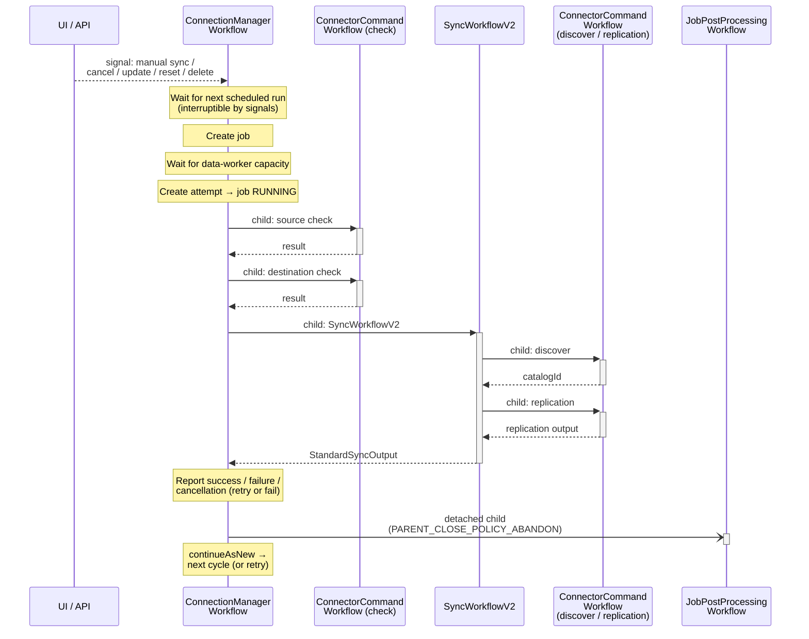
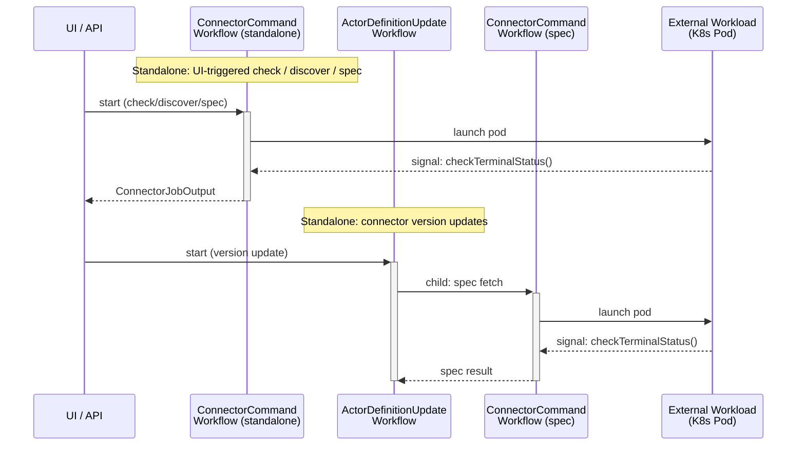

# Temporal Workflow Orchestration

## Contents

- [Introduction](#introduction)
  - [What is Temporal?](#what-is-temporal)
  - [How Airbyte Uses Temporal](#how-airbyte-uses-temporal)
  - [Historical Context](#historical-context)
  - [Modernization Opportunities](#modernization-opportunities)
- [2.1 Workflow Topology](#21-workflow-topology)
  - [Workflow Interaction Diagram](#workflow-interaction-diagram)
- [2.2 ConnectionManagerWorkflow](#22-connectionmanagerworkflow)
- [2.3 Error Handling](#23-error-handling)
- [2.4 Retry System](#24-retry-system)
- [2.5 Capacity Gating](#25-capacity-gating)
- [2.6 Pre-Sync Checks](#26-pre-sync-checks)
- [2.7 SyncWorkflowV2](#27-syncworkflowv2)
- [2.8 ConnectorCommandWorkflow](#28-connectorcommandworkflow)
- [2.9 JobPostProcessingWorkflow](#29-jobpostprocessingworkflow)
- [2.10 Task Queue Architecture](#210-task-queue-architecture)
- [2.11 Activity Options](#211-activity-options)
- [2.12 Deprecated Workflows](#212-deprecated-workflows)
- [2.13 Temporal Versioning](#213-temporal-versioning)
- [2.14 Temporal Self-Heal Cron](#214-temporal-self-heal-cron)
- [2.15 Other Temporal Workflows](#215-other-temporal-workflows)

Temporal is the backbone of Airbyte's job orchestration. Every sync, check, discover, and spec operation runs through Temporal workflows. This is the largest and most complex area of the platform.

## Introduction

### What is Temporal?

[Temporal](https://temporal.io/) is a durable execution platform that lets you write long-running, fault-tolerant business logic as ordinary code. The runtime persists every step a workflow takes (each activity invocation, signal, timer, etc.) to a durable event history. If a worker crashes, the workflow is replayed from history on a new worker and resumes exactly where it left off — workflow code does not need to manually checkpoint state.

Key primitives:

- **Workflow** — deterministic orchestration code that drives the business logic. Cannot do I/O directly.
- **Activity** — non-deterministic unit of work (HTTP calls, DB queries, launching pods). Workflows call activities; results are recorded in history so re-runs replay deterministically.
- **Signal** — fire-and-forget message sent to a running workflow.
- **Query** — synchronous read-only view into a running workflow's state.
- **Child workflow** — workflow started by another workflow, with configurable parent-close policies.
- **`continueAsNew`** — atomically restarts the current workflow with new input, dropping the event history. Required for workflows that would otherwise exceed the ~50K event history limit.

### How Airbyte Uses Temporal

Airbyte runs one long-running `ConnectionManagerWorkflow` per connection. That workflow handles **everything** related to that connection's lifecycle:

- **Scheduling.** Computes the next run time and calls `Workflow.await(duration)` to sleep until then.
- **Signal-driven control.** Manual syncs, cancellations, deletions, configuration updates, and resets are all delivered as signals that interrupt the wait or the running sync.
- **Job creation.** Creates the job/attempt rows in the platform DB through activities.
- **Pre-sync checks.** Spawns child `ConnectorCommandWorkflow`s to run source/destination connection checks.
- **Sync execution.** Spawns a `SyncWorkflowV2` child, which in turn spawns `ConnectorCommandWorkflow`s for discover and replication.
- **Retry decisions.** Tracks failure history, applies exponential backoff, decides whether to retry or fail.
- **Continuation.** After each cycle (success, failure, or retry) calls `continueAsNew` to start fresh, keeping the workflow alive forever.

In addition, `ConnectorCommandWorkflow` runs standalone for UI-triggered check/discover/spec operations, and a small number of cloud-only workflows handle billing, grace periods, and AWS PrivateLink provisioning.

### Historical Context

Airbyte adopted Temporal in early 2021, and the current "new Temporal scheduler" architecture (`ConnectionManagerWorkflow`) was introduced in late 2021. At that time several Temporal features that we now reach for did not yet exist or were not generally available:

| Feature | Available since | Status when Airbyte's design was made |
|---------|----------------|----------------------------------------|
| **Temporal Schedules** | June 2022 | Did not exist. Scheduling had to be implemented inside the workflow via `Workflow.await` + `continueAsNew`. |
| **Workflow Updates** (synchronous request-response with validation) | GA May 2024 | Did not exist. All workflow→client communication had to go through signals (fire-and-forget) + queries (read-only), with the caller orchestrating the round-trip. |
| **Update-with-Start** | 2024 | Did not exist. |
| **Worker Versioning / Build IDs** | GA 2024 | Did not exist. The only safe way to evolve workflow logic was `Workflow.getVersion()` gates baked into the workflow code. |
| **Temporal Nexus** (cross-namespace workflow calls) | Preview 2024 | Did not exist. |

As a result, the current design carries a fair amount of "doing it ourselves" that Temporal can now do natively.

### Modernization Opportunities

The platform is on Temporal Java SDK 1.33.0, which means all the modern primitives are technically available. The implementation has not yet been refactored to use them. Concrete opportunities, ordered by impact:

#### 1. Replace the custom scheduler with Temporal Schedules

**Current:** `ConnectionManagerWorkflow` lives forever, computes the next run time via `configFetchActivity.getTimeToWait()`, sleeps with `Workflow.await(duration) { shouldInterruptWaiting() }`, runs one cycle, then calls `continueAsNew`. The 50K event history limit is the only reason `continueAsNew` exists.

**With Schedules:** Each connection becomes a Temporal Schedule that fires a `SyncWorkflow` execution per run. Each execution is short-lived and self-contained — no `continueAsNew`, no event-history budgeting.

Schedules natively support:
- **Pause / unpause** → replaces "active / inactive" connection state plumbing.
- **Trigger now** → replaces the `submitManualSync()` signal.
- **Backfill** → would unblock historical re-runs cleanly.
- **Overlap policies** (`SKIP`, `BUFFER_ONE`, `CANCEL_OTHER`, `TERMINATE_OTHER`, `ALLOW_ALL`) → today this is implemented manually through capacity gating, queueing, and signal handling.
- **Catchup window** → today the load-shed backoff loop and various early-return guards do this implicitly.
- **First-class metrics** for missed runs, overlapping runs, etc.

This is the single biggest simplification available. A large portion of `ConnectionManagerWorkflowImpl` (~1,660 lines) exists only to bridge the gap between "I want a schedule" and "I have a long-running workflow."

#### 2. Replace selected signals with Updates

**Current:** `submitManualSync()`, `cancelJob()`, `connectionUpdated()`, `resetConnection()` are all signals. The caller has no way to know when the workflow has actually processed them — it must poll `getState()` / `getJobInformation()` queries.

**With Updates:** These become synchronous calls that can return a result and even reject invalid requests in a `@UpdateValidatorMethod`. For example, `submitManualSync()` could return the newly-created `jobId` directly to the caller.

The codebase already uses `@UpdateMethod` in `ConnectorRolloutWorkflow` (mentioned in §2.15), so the pattern is proven internally — it just hasn't been adopted in the hot path.

#### 3. Replace `Workflow.getVersion()` with Worker Versioning

**Current:** Versioning tags like `check_workspace_tombstone`, `load_shed_back_off`, `get_feature_flags`, `capacity_check`, and `useAwaitFromCommand` are hard-coded in the workflow body and accumulate over time. They are forever — the old branch must remain for replay determinism, even when no live execution is on the old version.

**With Worker Versioning (Build IDs):** Workflows are pinned to a specific worker build. Old executions stay on old workers; new executions go to new workers. Workflow code stays clean, and old branches can be deleted once the matching build retires.

#### 4. Lean on built-in retry policies where possible

**Current:** A custom `RetryManager` tracks complete vs. partial failures with separate counters and a custom `BackoffPolicy`. Some of this is genuinely Airbyte-specific (the partial-vs-complete distinction, persistence across `continueAsNew`), but the exponential-backoff math itself duplicates Temporal's `RetryOptions`.

**With native retries:** If/when Schedules replace the custom scheduler, each sync execution gets its own `RetryOptions`, and the only state to persist across runs is the partial-vs-complete failure history.

#### 5. Reconsider the self-heal cron

**Current:** `SelfHealTemporalWorkflows` runs every 10s, finds closed/FAILED `ConnectionManagerWorkflow`s with no live counterpart, and restarts them. This compensates for non-determinism crashes and the long-lived nature of the workflow.

**With Schedules:** The need largely disappears — there is no eternal workflow to keep alive. A failed individual sync execution is just a failed execution; the schedule fires the next one on time.

#### Pragmatic note

These changes are **not** a "drop everything and rewrite" recommendation. The current design works and has been hardened by years of production traffic. The point of this section is to make the historical context explicit so that anyone touching this code understands which patterns are load-bearing and which are vestiges of an older Temporal.

The rest of this document describes the system as it exists today.

## 2.1 Workflow Topology

The system has a three-level parent-child workflow tree:

```
ConnectionManagerWorkflow (long-running, one per connection)
  |
  |  [pre-sync checks]
  +-- [child] ConnectorCommandWorkflow (check source)
  +-- [child] ConnectorCommandWorkflow (check destination)
  |
  |  [sync]
  +-- [child] SyncWorkflowV2
  |     |
  |     +-- [child] ConnectorCommandWorkflow (discover catalog)
  |     +-- [child] ConnectorCommandWorkflow (replication)
  |
  |  [post-sync]
  +-- [child, detached] JobPostProcessingWorkflow
```

### Workflow Interaction Diagram

Two views of the same lifecycle are available below. The simplified diagram is a high-level orientation; the detailed diagram traces every activity call and signal in order. Both are collapsed by default.

<details>
<summary><strong>Simplified flow (high-level overview)</strong></summary>



</details>

<details>
<summary><strong>Detailed flow (every activity, signal, and child workflow)</strong></summary>

The following sequence diagram shows the full lifecycle of a sync job, including the interactions between workflows, activities, signals, and external systems.

```mermaid
sequenceDiagram
    participant UI as UI / API / Schedule
    participant CMW as ConnectionManager<br/>Workflow
    participant Activities as Activities<br/>(11 total)
    participant CCW_Check as ConnectorCommand<br/>Workflow (check)
    participant SyncV2 as SyncWorkflowV2
    participant CCW_Discover as ConnectorCommand<br/>Workflow (discover)
    participant CCW_Repl as ConnectorCommand<br/>Workflow (replication)
    participant Workload as External Workload<br/>(K8s Pod)
    participant JPPW as JobPostProcessing<br/>Workflow

    Note over CMW: Long-running (one per connection)<br/>Restarts via continueAsNew

    %% Signals
    UI -->> CMW: signal: submitManualSync() /<br/>cancelJob() / deleteConnection() /<br/>connectionUpdated() / resetConnection()

    %% Phase 0: Early Guards
    Note over CMW,Activities: Phase 0 — Early Guards
    CMW ->> Activities: isWorkspaceTombstone()
    Activities -->> CMW: yes / no
    Note over CMW: If tombstoned → return
    CMW ->> Activities: getConnectionContext()
    Activities -->> CMW: connectionContext
    CMW ->> Activities: getLoadShedBackoff()
    Activities -->> CMW: backoff duration
    Note over CMW: Sleep loop while<br/>load-shedding
    CMW ->> Activities: recordWorkflowCountMetric(ATTEMPT)

    %% Phase 1: Cancellation Scope opens
    Note over CMW,Activities: Phase 1 — Clean State + Pre-Schedule
    CMW ->> Activities: ensureCleanJobState()
    Note over CMW: Skipped if input.jobId is set<br/>(retry carry-over)
    CMW ->> Activities: hydrateRetryState()
    Activities -->> CMW: RetryManager (or null)
    CMW ->> Activities: getTimeToWait() / resolveBackoff()
    Activities -->> CMW: wait duration
    Note over CMW: Workflow.await(duration)<br/>Interruptible by signals

    %% Phase 2: After wait, job creation
    Note over CMW,Activities: Phase 2 — Post-Wait Job Creation
    CMW ->> Activities: hydrateRetryState() (re-hydrate)
    Activities -->> CMW: RetryManager
    CMW ->> Activities: getFeatureFlags()
    Activities -->> CMW: flags
    CMW ->> Activities: createNewJob()
    Activities -->> CMW: jobId
    Note over CMW: Skipped if input.jobId is set

    %% Capacity Gating
    Note over CMW,Activities: Phase 3 — Capacity Gating
    CMW ->> Activities: checkCapacity()
    Activities -->> CMW: capacity / on-demand
    Note over CMW: If no capacity:
    CMW ->> Activities: setJobQueued()
    CMW ->> Activities: getTimeToWait() (cutoff)
    Note over CMW: Poll loop every 1 min:<br/>checkCapacity() until granted,<br/>scheduled cutoff,<br/>or 8h manual timeout
    Note over CMW: On timeout / signal:<br/>cancelJob() (pre-attempt) +<br/>continueAsNew

    %% Attempt Creation
    Note over CMW,Activities: Phase 4 — Attempt Creation
    CMW ->> Activities: createNewAttemptNumber()
    Activities -->> CMW: attemptNumber
    Note over CMW: Job → RUNNING
    CMW ->> Activities: reportJobStart()

    %% Pre-Sync Checks
    Note over CMW,CCW_Check: Phase 5 — Pre-Sync Checks (child workflows)
    CMW ->> Activities: shouldRunSourceCheck()
    Activities -->> CMW: yes/no
    CMW ->>+ CCW_Check: child: check source<br/>(check_{jobId}_source)
    CCW_Check ->> Activities: startCommand()
    Activities -->> CCW_Check: workloadId
    CCW_Check ->> Workload: launch pod
    Workload -->> CCW_Check: signal: checkTerminalStatus()
    CCW_Check ->> Activities: getCommandOutput()
    Activities -->> CCW_Check: result
    CCW_Check -->>- CMW: check result

    CMW ->> Activities: shouldRunDestinationCheck()
    Activities -->> CMW: yes/no
    CMW ->>+ CCW_Check: child: check destination<br/>(check_{jobId}_destination)
    CCW_Check ->> Workload: launch + poll
    CCW_Check -->>- CMW: check result
    Note over CMW: If any check fails →<br/>reportFailure() (see Phase 7)

    %% Sync
    Note over CMW,CCW_Repl: Phase 6 — Sync (child workflow tree)
    CMW ->>+ SyncV2: child: SyncWorkflowV2

    %% Discover
    SyncV2 ->>+ CCW_Discover: child: discover<br/>(discover_{jobId}_{attemptId})
    CCW_Discover ->> Workload: launch pod
    Workload -->> CCW_Discover: signal: checkTerminalStatus()
    CCW_Discover -->>- SyncV2: discoverCatalogId

    SyncV2 ->> Activities: postprocess(catalogId)
    Activities -->> SyncV2: CatalogDiff (auto-propagation)

    SyncV2 ->> Activities: getStatus(connectionId)
    Activities -->> SyncV2: status
    Note over SyncV2: If INACTIVE/LOCKED → return CANCELLED

    %% Replication
    SyncV2 ->>+ CCW_Repl: child: replication<br/>(replication_{jobId})
    CCW_Repl ->> Workload: launch pod
    Workload -->> CCW_Repl: signal: checkTerminalStatus()
    CCW_Repl -->>- SyncV2: replication output

    SyncV2 ->> Activities: getConnectionContext()
    SyncV2 ->> Activities: getWebhookConfig()
    SyncV2 ->> Activities: invokeOperationsV2() (webhooks)
    SyncV2 -->>- CMW: StandardSyncOutput

    %% Terminal Outcome
    Note over CMW,JPPW: Phase 7 — Terminal Outcome
    alt Success
        CMW ->> Activities: jobSuccessWithAttemptNumber()
        CMW -)+ JPPW: detached child (SUCCEEDED)<br/>(PARENT_CLOSE_POLICY_ABANDON)
        CMW ->> Activities: deleteStreamResetRecordsForJob()
        CMW ->> Activities: recordWorkflowCountMetric(SUCCESS)
    else Failure (retryable)
        CMW ->> Activities: attemptFailureWithAttemptNumber()
        CMW ->> Activities: checkRunProgress() (fallback)
        CMW ->> Activities: persistRetryState() (fallback)
        Note over CMW: continueAsNew<br/>with fromFailure=true
    else Failure (final or CONFIG_ERROR)
        CMW ->> Activities: attemptFailureWithAttemptNumber()
        CMW ->> Activities: jobFailure()
        CMW -)+ JPPW: detached child (FAILED)
        CMW ->> Activities: autoDisableFailingConnection()
        CMW ->> Activities: recordWorkflowCountMetric(FAILURE)
    else Cancelled
        CMW ->> Activities: jobCancelledWithAttemptNumber()
        CMW -)+ JPPW: detached child (CANCELLED)
    end

    Note over JPPW: If status != SUCCEEDED: sleep 10 min
    JPPW ->> Activities: finalizeJobStats()
    JPPW ->> Activities: evaluateOutlier()
    deactivate JPPW

    Note over CMW: continueAsNew →<br/>next cycle (fresh or retry)
```



</details>

Additionally, two workflows run standalone (not as children):



All parent-child relationships use `PARENT_CLOSE_POLICY_REQUEST_CANCEL`, meaning if a parent terminates, children receive a cancellation request. The one exception is `JobPostProcessingWorkflow`, which uses `PARENT_CLOSE_POLICY_ABANDON` so it survives parent termination.

## 2.2 ConnectionManagerWorkflow

**Interface:** [`oss/airbyte-commons-temporal/src/main/kotlin/io/airbyte/commons/temporal/scheduling/ConnectionManagerWorkflow.kt`](../../oss/airbyte-commons-temporal/src/main/kotlin/io/airbyte/commons/temporal/scheduling/ConnectionManagerWorkflow.kt)
**Implementation:** [`oss/airbyte-workers/src/main/kotlin/io/airbyte/workers/temporal/scheduling/ConnectionManagerWorkflowImpl.kt`](../../oss/airbyte-workers/src/main/kotlin/io/airbyte/workers/temporal/scheduling/ConnectionManagerWorkflowImpl.kt) (~1,660 lines)

This is the central orchestrator. One instance runs per connection and lives forever via `continueAsNew`. It manages scheduling, job creation, pre-sync checks, sync execution, retries, and failure handling.

<details>
<summary><strong>Signals and Queries</strong></summary>

| Method | Type | Purpose |
|--------|------|---------|
| `run(ConnectionUpdaterInput)` | `@WorkflowMethod` | Main entry point; processes one job cycle then calls `continueAsNew` |
| `submitManualSync()` | `@SignalMethod` | Bypass schedule, trigger immediate sync |
| `cancelJob()` | `@SignalMethod` | Cancel current running sync |
| `deleteConnection()` | `@SignalMethod` | Cancel job + terminate workflow (no `continueAsNew`) |
| `connectionUpdated()` | `@SignalMethod` | Config changed; restart with fresh config via `continueAsNew` |
| `resetConnection()` | `@SignalMethod` | Cancel for reset; re-run with reset flag |
| `resetConnectionAndSkipNextScheduling()` | `@SignalMethod` | Reset + skip the next scheduling wait |
| `getState()` | `@QueryMethod` | Returns current `WorkflowState` |
| `getJobInformation()` | `@QueryMethod` | Returns current job ID and attempt number |

Signals only set state flags on the `WorkflowState` object. The actual reaction happens at predefined check points (after `Workflow.await`, after cancellation scope exits, in the capacity wait loop). There is no preemptive interruption of activities or child workflows except through explicit scope cancellation.

</details>

<details>
<summary><strong>The Main Loop (step by step)</strong></summary>

The `run()` method processes exactly one job cycle per invocation and then calls `continueAsNew` to start a fresh execution. This prevents Temporal's event history from growing unbounded (50K event limit).

**Phase 0: Early Guards**

1. If `connectionId` is null or the workspace is tombstoned, return immediately.
2. Hydrate connection context (workspace, org, source, destination IDs) via `configFetchActivity.getConnectionContext()`.
3. Load-shed backoff loop: calls `configFetchActivity.getLoadShedBackoff()` and sleeps while the duration is positive. This is a blocking poll that backs off when the platform is overloaded.
4. Initialize workflow state from the input. If `fromFailure=true`, marks `isRunning=true`. Restores `jobId`/`attemptNumber` from the previous run.
5. Fetch the configurable restart delay (used if mandatory activities fail later).

**Phase 1: The Cancellation Scope**

The entire sync logic runs inside a `CancellationScope`. This is how signal handlers can abort the current job -- they call `.cancel()` on the scope.

Inside the scope:

1. **Ensure clean job state.** Calls `ensureCleanJobState()` to fail any orphaned non-terminal jobs for this connection. This cleans up after crashes. Skipped if a `jobId` already exists on the input (retry scenario).

2. **Hydrate RetryManager.** Loads retry state from the persistence layer. Uses `runActivityWithFallback` (non-mandatory), falling back to null if hydration fails.

3. **Calculate wait time.** Two paths:
   - Normal run: `getTimeTilScheduledRun()` calls `configFetchActivity.getTimeToWait()` to determine the schedule-based delay. Returns `Duration.ZERO` for manual syncs.
   - From failure (retry): `resolveBackoff()` delegates to `retryManager.backoff` for exponential backoff. Falls back to `Duration.ZERO` if the retry manager is null.

4. **Wait with interruption.** `Workflow.await(timeToWait) { shouldInterruptWaiting() }` blocks the workflow until either the time elapses or a signal sets one of: `isSkipScheduling`, `isDeleted`, `isUpdated`, or `isCancelled`.

5. **Post-wait signal handling.**
   - If **deleted**: return from scope immediately (workflow will terminate).
   - If **updated**: reset state and call `Workflow.continueAsNew()` to reload config.
   - If **cancelled**: report cancellation and continue as new.

6. **Re-hydrate RetryManager** (feature flags may have changed during the wait).

7. **Fetch feature flags** via `featureFlagFetchActivity.getFeatureFlags()`.

8. **Create or reuse job.** If `connectionUpdaterInput.jobId` is set (retry), reuse it. Otherwise, call `jobCreationAndStatusUpdateActivity.createNewJob()`.

9. **Capacity check and wait** (see [Capacity Gating](#25-capacity-gating) below).

10. **Create attempt.** Transitions the job to RUNNING.

11. **Check connections** (see [Pre-Sync Checks](#26-pre-sync-checks) below).

12. **Run sync.** Launches `SyncWorkflowV2` as a child workflow (see [SyncWorkflowV2](#27-syncworkflowv2) below).

13. **Handle result:**
    - Failed: `reportFailure()` (may retry or fail the job -- see [Retry System](#24-retry-system) below).
    - Cancelled: report cancellation and continue as new.
    - Success: mark job success, run end-of-sync hooks, delete reset stream records, record metrics, reset input.

14. **Continue as new.** Always called after success/failure/check-failure.

**Phase 2: Post-Scope Handling**

After the cancellation scope exits (either normally or via `CanceledFailure`):

- `CanceledFailure` is caught and treated as expected behavior (a signal cancelled the scope).
- If `isDeleted`: report cancellation if a sync was running, then `return` (workflow ends -- no `continueAsNew`).
- If `isCancelledForReset`: cancel job, continue as new with `skipScheduling=true` so the reset runs immediately.
- If `isCancelled`: cancel job, continue as new.

**Phase 3: Outer Exception Handler**

Catches any unhandled exception from the entire `run()` method. This is the ultimate safety net:
- Logs the error.
- Calls `reportFailure()` with `FailureCause.UNKNOWN`.
- Calls `continueAsNew` to keep the workflow alive.

The workflow never dies from an unhandled exception. It always restarts.

</details>

<details>
<summary><strong>continueAsNew and State Passing</strong></summary>

Only `ConnectionUpdaterInput` is passed across `continueAsNew` boundaries. This carries:

| Field | Purpose |
|-------|---------|
| `connectionId` | The connection this workflow manages |
| `jobId` | Set when retrying a failed job; null otherwise |
| `attemptNumber` | Incremented on retry |
| `fromFailure` | `true` when this run is a retry |
| `skipScheduling` | `true` to skip the scheduling wait (reset, manual sync) |
| `resetConnection` | `true` when a reset is requested |
| `fromJobResetFailure` | `true` when retrying a failed reset job |

Everything else is reconstructed each cycle:
- `WorkflowState` is fully reset via `reset()`.
- `WorkflowInternalState` (failures, partialSuccess) is cleared.
- `RetryManager` is re-hydrated from the persistence layer.
- Connection context is re-fetched from the config API.

On success or final failure, the input is cleaned: `jobId=null`, `attemptNumber=1`, `fromFailure=false`, `skipScheduling=false`. On retry (continuing from failure), `attemptNumber` is incremented, `fromFailure=true`, and `jobId` is preserved.

</details>

<details>
<summary><strong>State Objects</strong></summary>

**WorkflowState** ([`oss/airbyte-commons-temporal/src/main/kotlin/io/airbyte/commons/temporal/scheduling/state/WorkflowState.kt`](../../oss/airbyte-commons-temporal/src/main/kotlin/io/airbyte/commons/temporal/scheduling/state/WorkflowState.kt))

Externally visible (queryable) state. All setters fire `ChangedStateEvent` to a listener. Fields: `isRunning`, `isDeleted`, `isSkipScheduling`, `isUpdated`, `isCancelled`, `isFailed`, `isSuccess`, `isCancelledForReset`, `isDoneWaiting`, `isSkipSchedulingNextWorkflow`. `reset()` sets all fields to false.

**WorkflowInternalState** ([`oss/airbyte-commons-temporal/src/main/kotlin/io/airbyte/commons/temporal/scheduling/state/WorkflowInternalState.kt`](../../oss/airbyte-commons-temporal/src/main/kotlin/io/airbyte/commons/temporal/scheduling/state/WorkflowInternalState.kt))

Internal mutable state, not queryable:
- `jobId: Long?` -- current job ID.
- `attemptNumber: Int?` -- 0-based attempt number.
- `failures: MutableSet<FailureReason>` -- accumulated failure reasons for the current attempt.
- `partialSuccess: Boolean?` -- whether any records were committed before failure.

</details>

<details>
<summary><strong>Activities (11 total)</strong></summary>

`ConnectionManagerWorkflowImpl` injects exactly 11 `@TemporalActivityStub` activities, all using `shortActivityOptions`. Each activity below lists every method invoked from this workflow.

**Wrapper legend** — invocation patterns used throughout the workflow:

| Wrapper | Behavior on failure |
|---------|---------------------|
| **mandatory** (`runMandatoryActivityWithOutput` / `runMandatoryActivity`) | Sleep `workflowRestartDelaySeconds`, call `reportFailure(UNKNOWN)`, then `continueAsNew`. The workflow restarts from scratch. |
| **fallback** (`runActivityWithFallback`) | Log + emit `ACTIVITY_FAILURE` metric (via `tryRecordCountMetric`) + return a caller-provided default value. The workflow continues. |
| **try** (`tryRecordCountMetric`) | Catch + log; no metric/restart. Used for best-effort metric emission only. |
| **direct** | No wrapper. Exception propagates and is caught by either the cancellation scope or the outermost `try/catch` in `run()`. |

#### [`JobCreationAndStatusUpdateActivity`](../../oss/airbyte-workers/src/main/kotlin/io/airbyte/workers/temporal/scheduling/activities/JobCreationAndStatusUpdateActivity.kt) — job/attempt state machine

The largest surface — 12 distinct methods invoked. Owns every transition of the Jobs/Attempts DB rows.

| Method | Wrapper | Phase | Description |
|--------|---------|-------|-------------|
| `ensureCleanJobState` | mandatory | Phase 1 (pre-schedule) | Fails any orphaned non-terminal jobs for this connection left over from a crashed/restarted workflow. Skipped when `input.jobId` is set (retry carry-over). |
| `createNewJob` | mandatory | Phase 2 (post-wait) | Creates a new Jobs row in `PENDING`, returns the new `jobId`. Skipped when `input.jobId` is set (retry reuses the same job). |
| `setJobQueued` | mandatory | Phase 3 (capacity) | Transitions the job `PENDING` → `QUEUED` while waiting for data-worker capacity. |
| `cancelJob` | mandatory | Phase 3 (capacity) | Cancels a queued job *before* any attempt is created (capacity-wait timeout or interrupting signal). |
| `createNewAttemptNumber` | mandatory | Phase 4 (attempt) | Creates a new attempt row, transitions the job to `RUNNING`, returns the 0-based attempt number. |
| `reportJobStart` | mandatory | Phase 4 (attempt) | Notifies job tracker / analytics that the attempt has begun running. |
| `shouldRunSourceCheck` | mandatory | Phase 5 (checks) | Gate query: should the platform run a source CHECK (e.g. skip if there was a recent successful check)? |
| `shouldRunDestinationCheck` | mandatory | Phase 5 (checks) | Same gate for the destination CHECK. Always skipped if the source check already failed. |
| `jobSuccessWithAttemptNumber` | mandatory | Phase 7 (success) | Marks attempt + job `SUCCEEDED` and persists the `StandardSyncOutput` summary. |
| `attemptFailureWithAttemptNumber` | mandatory | Phase 7 (failure, both retryable and final) | Marks the current attempt `FAILED` and persists failure reasons. Does **not** terminate the job. |
| `jobFailure` | mandatory | Phase 7 (final failure) | Marks the whole job `FAILED` — terminal; no more retries. |
| `jobCancelledWithAttemptNumber` | mandatory | Phase 7 (cancelled) | Marks attempt + job `CANCELLED` and persists a cancellation `FailureSummary`. |

#### [`ConfigFetchActivity`](../../oss/airbyte-workers/src/main/kotlin/io/airbyte/workers/temporal/scheduling/activities/ConfigFetchActivity.kt) — connection / schedule / tenant config

Used in CMW for the early guards and scheduling math. (`getStatus` and `getWebhookConfig` exist on the same interface but are only called from `SyncWorkflowV2`, not here.)

| Method | Wrapper | Phase | Description |
|--------|---------|-------|-------------|
| `isWorkspaceTombstone` | direct | Phase 0 (guards) | Returns `true` if the workspace is tombstoned (deleted); workflow returns immediately if so. Gated behind the `check_workspace_tombstone` version tag. |
| `getConnectionContext` | mandatory | Phase 0 (guards) | Hydrates `ConnectionContext` (workspaceId, orgId, sourceId, destinationId). First mandatory call in `run()`. |
| `getLoadShedBackoff` | direct (in `while` loop) | Phase 0 (guards) | Returns a backoff `Duration` if this tenant is currently load-shed. Workflow sleeps and re-polls until the duration is non-positive. Gated behind `load_shed_back_off`. |
| `getTimeToWait` | mandatory | Phase 1 (pre-schedule) **and** Phase 3 (capacity) | Computes the duration until the next scheduled run. Called once for the main scheduling wait, then again to compute the cutoff for the capacity-wait loop. |
| `getMaxAttempt` | direct | Phase 7 (retry decision, fallback path) | Returns the configured max attempts. Only consulted when `RetryManager` hydration failed and the workflow falls back to simple attempt-count retries. |

#### [`AutoDisableConnectionActivity`](../../oss/airbyte-workers/src/main/kotlin/io/airbyte/workers/temporal/scheduling/activities/AutoDisableConnectionActivity.kt) — connection auto-disable

| Method | Wrapper | Phase | Description |
|--------|---------|-------|-------------|
| `autoDisableFailingConnection` | mandatory | Phase 7 (final failure) | If the connection's consecutive-failure / time threshold has been hit, disables it. Returns whether it was disabled (used to emit an "Auto-disabled" attempt log line). |

#### [`StreamResetActivity`](../../oss/airbyte-workers/src/main/kotlin/io/airbyte/workers/temporal/scheduling/activities/StreamResetActivity.kt) — reset bookkeeping

| Method | Wrapper | Phase | Description |
|--------|---------|-------|-------------|
| `deleteStreamResetRecordsForJob` | mandatory | Phase 7 (success) | Removes `stream_reset` rows for streams that were successfully reset in this job. Only called on success; failed/cancelled resets stay queued. |

#### [`RecordMetricActivity`](../../oss/airbyte-workers/src/main/kotlin/io/airbyte/workers/temporal/scheduling/activities/RecordMetricActivity.kt) — metric emission

A single method called through two different wrappers depending on whether the metric is required or best-effort.

| Method | Wrapper | Phase | Description |
|--------|---------|-------|-------------|
| `recordWorkflowCountMetric` | mandatory (via `recordMetric`) | Phase 0 (`TEMPORAL_WORKFLOW_ATTEMPT`), Phase 3 (`TEMPORAL_WORKFLOW_FAILURE` with `CAPACITY_WAIT_EXCEEDED`), Phase 7 success (`TEMPORAL_WORKFLOW_SUCCESS`), Phase 7 final failure (`TEMPORAL_WORKFLOW_FAILURE`), recovery (`TEMPORAL_WORKFLOW_FAILURE` with `CANCELED`) | Emits a count metric tagged with connection / job context. Lifecycle markers — must not be lost, so failure restarts the workflow. |
| `recordWorkflowCountMetric` | try (via `tryRecordCountMetric`) | Phase 7 retryable + final failure (`REPLICATION_MADE_PROGRESS` via `recordProgressMetric`); any phase (`ACTIVITY_FAILURE` from inside `recordActivityFailure`) | Same activity method, but exceptions are caught and logged. Used for observational metrics where dropping one is preferable to restarting the workflow. |

#### [`WorkflowConfigActivity`](../../oss/airbyte-workers/src/main/kotlin/io/airbyte/workers/temporal/scheduling/activities/WorkflowConfigActivity.kt) — restart delay

| Method | Wrapper | Phase | Description |
|--------|---------|-------|-------------|
| `getWorkflowRestartDelaySeconds` | direct | Phase 0 (guards) | Returns the configured delay (default 600s) used by mandatory-activity recovery before calling `continueAsNew`. Cached into `workflowDelay` once per cycle; re-fetched on activity failure as a safety net. |

#### [`FeatureFlagFetchActivity`](../../oss/airbyte-workers/src/main/kotlin/io/airbyte/workers/temporal/scheduling/activities/FeatureFlagFetchActivity.kt) — feature flags

| Method | Wrapper | Phase | Description |
|--------|---------|-------|-------------|
| `getFeatureFlags` | mandatory | Phase 2 (post-wait) | Resolves workflow-scoped feature flags (e.g. `EnforceDataWorkerCapacity`) up front so downstream activities don't need to refetch. Gated behind `get_feature_flags`. |

#### [`CheckRunProgressActivity`](../../oss/airbyte-workers/src/main/kotlin/io/airbyte/workers/temporal/scheduling/activities/CheckRunProgressActivity.kt) — partial-success detector

| Method | Wrapper | Phase | Description |
|--------|---------|-------|-------------|
| `checkProgress` | fallback (default `Output(false)`) | Phase 7 (retryable + final failure) | Returns whether the failed attempt committed any records. Drives the partial-vs-complete failure split in `RetryManager` and tags the `REPLICATION_MADE_PROGRESS` metric. Fallback is critical here: a failure of *this* activity must not itself trigger a restart loop. |

#### [`RetryStatePersistenceActivity`](../../oss/airbyte-workers/src/main/kotlin/io/airbyte/workers/temporal/scheduling/activities/RetryStatePersistenceActivity.kt) — RetryManager I/O

| Method | Wrapper | Phase | Description |
|--------|---------|-------|-------------|
| `hydrateRetryState` | fallback (default `HydrateOutput(null)` → triggers attempt-count fallback) | Phase 1 (pre-schedule) **and** Phase 2 (post-wait) | Loads the persisted `RetryManager`. Called **twice**: once before the schedule wait (so `resolveBackoff` can use it), and once again after the wait because feature flags may have changed during the wait. |
| `persistRetryState` | fallback (default `PersistOutput(false)`) | Phase 7 (retryable + final failure) | Persists the updated `RetryManager` after a failure is accumulated. Only called when a `RetryManager` is present (i.e. hydration succeeded). |

#### [`AppendToAttemptLogActivity`](../../oss/airbyte-workers/src/main/kotlin/io/airbyte/workers/temporal/scheduling/activities/AppendToAttemptLogActivity.kt) — user-visible attempt logs

A single `log` method invoked at six distinct points to surface workflow-level events in the attempt log shown in the Airbyte UI.

| Method | Wrapper | Phase / Call site | Description |
|--------|---------|-------------------|-------------|
| `log` | fallback | Phase 1 (after `hydrateRetryState`) | "Retry State: …" — current counters / limits. |
| `log` | fallback | Phase 1 (`resolveBackoff`) | "Backing off for: …" — only when `fromFailure=true`. |
| `log` | fallback | Phase 3 (capacity, on-demand path) | "Using on-demand capacity for this run." |
| `log` | fallback | Phase 3 (capacity, wait path) | "Waiting for Data Worker capacity…" plus end-of-wait messages: "Next scheduled sync time reached…", "Manual sync waited 8 hours…", or "Capacity now available…". |
| `log` | fallback | Phase 7 (final failure, `failJob`) | "Failing job: … reason: …" |
| `log` | fallback | Phase 7 (retryable + final failure, `accumulateFailureAndPersist`) | "Retry State: … Backoff before next attempt: …" — counters + next-retry timing. |

#### [`CapacityCheckActivity`](../../oss/airbyte-workers/src/main/kotlin/io/airbyte/workers/temporal/scheduling/activities/CapacityCheckActivity.kt) — data-worker capacity gate

| Method | Wrapper | Phase | Description |
|--------|---------|-------|-------------|
| `checkCapacity` | mandatory | Phase 3 (capacity) | Asks platform whether the org has committed data-worker capacity, or whether on-demand scaling is allowed. Called once initially, then repolled every minute inside the capacity-wait loop. Gated behind the `capacity_check` version tag and the `EnforceDataWorkerCapacity` feature flag. |

</details>

<details>
<summary><strong><code>runMandatoryActivity</code> / <code>runMandatoryActivityWithOutput</code></strong></summary>

These two private helpers in `ConnectionManagerWorkflowImpl` are the wrapper used for every "the workflow cannot proceed without this" activity call. They turn any uncaught activity exception into a controlled workflow restart, with bookkeeping to keep the job/attempt state consistent.

#### Signatures

```kotlin
// returns the activity's result (or null if the activity returns null)
private fun <INPUT, OUTPUT> runMandatoryActivityWithOutput(
    mapper: Function<INPUT?, OUTPUT?>,
    input: INPUT?,
): OUTPUT?

// void-returning convenience variant — delegates to runMandatoryActivityWithOutput
// with a mapper that calls the consumer and returns null
private fun <INPUT> runMandatoryActivity(
    consumer: Consumer<INPUT?>,
    input: INPUT?,
)
```

The two functions exist only because Kotlin/Java don't combine a generic `Function<INPUT, OUTPUT>` cleanly with `void`-returning lambdas. `runMandatoryActivity` is a thin wrapper that calls `runMandatoryActivityWithOutput` with a lambda that returns `null` after invoking the consumer — so the failure semantics described below are identical for both.

#### Happy path

`mapper.apply(input)` is invoked and its return value is returned to the caller. No state changes, no logging — the wrapper is a no-op on success.

#### Failure path

When the lambda throws any `Exception`:

1. **Compute the restart delay.** `getWorkflowDelay()` returns the cached `workflowDelay` field (set once per `run()` cycle from `workflowConfigActivity.getWorkflowRestartDelaySeconds()`) or falls back to **600 seconds (10 minutes)** if it was never cached. The delay is deliberately long.
2. **Log `[ACTIVITY-FAILURE]`.** A single `error`-level line containing connectionId, the input class name, the planned sleep duration, and the stack trace. This is the canonical signal that a mandatory activity failed.
3. **Sleep durably.** `Workflow.sleep(sleepDuration)` — the Temporal SDK sleep (replays correctly across worker restarts), **not** `Thread.sleep`. This prevents a tight loop when the failing activity is configured with no Temporal retries (the wrapper's catch only fires after the activity's own `RetryOptions` are exhausted).
4. **Add the exception to the APM trace** via `addExceptionToTrace(e)` so the platform-failure surface in Datadog/APM tooling sees it.
5. **Record the attempt failure if possible.** If `workflowInternalState.jobId` *and* `workflowInternalState.attemptNumber` are both set, build a `platformFailure(e, jobId, attemptNumber)` reason and call:
   ```
   reportFailure(connectionUpdaterInputFromState(), null, FailureCause.ACTIVITY, {failureReason})
   ```
   This re-enters the normal terminal-failure path (`attemptFailureWithAttemptNumber` → optional `jobFailure` → retry decision) so the attempt counter, `RetryManager`, and `JobPostProcessingWorkflow` are all driven correctly.
6. **Otherwise log a warning** ("Can't properly fail the job, the next run will clean the state in the EnsureCleanJobStateActivity") and rely on the next cycle's `ensureCleanJobState()` to fail any orphaned non-terminal job for this connection.
7. **Build a fresh `ConnectionUpdaterInput`** via `TemporalWorkflowUtils.buildStartWorkflowInput(connectionId)` — `jobId=null`, `attemptNumber=1`, `fromFailure=false`, `skipScheduling=false`, `resetConnection=false`. The current job/attempt state is intentionally **not** carried forward; either `reportFailure` already accounted for it (step 5) or `ensureCleanJobState` will (step 6).
8. **`Workflow.continueAsNew(newWorkflowInput)`** — the workflow restarts from the top of `run()` on a fresh event history. Step 5's call to `reportFailure` may itself have called `continueAsNew` first; either way the wrapper ends with a continue-as-new.
9. The trailing `throw IllegalStateException("…was continued as new…")` is unreachable — Temporal terminates this execution at step 8. It exists only so the compiler accepts the method as a non-returning code path.

#### Why this matters

| Design choice | Reason |
|---|---|
| Long sleep before continue-as-new (600s default) | Activities with `maximumAttempts = 1` would otherwise restart Temporal workflows in a tight loop and overwhelm the cluster. The sleep is a circuit breaker. |
| Use `Workflow.sleep` (not `Thread.sleep`) | The sleep itself must be durable and deterministic — a worker can die during the sleep and a new worker will resume the timer. |
| Always discard the current job/attempt state on the new input | Either the attempt was already failed (step 5) or there is no live job to carry over (step 6). Reusing a stale `jobId` would confuse the next cycle's `ensureCleanJobState` / `getOrCreateJobId` logic. |
| Always restart, never just rethrow | The cancellation scope in `run()` catches `CanceledFailure` and treats it as expected. A plain `Exception` would bubble to the outer handler and result in a `FailureCause.UNKNOWN` restart anyway — handling it here lets the wrapper tag the failure as `FailureCause.ACTIVITY` instead, which is a more accurate diagnostic. |
| Per-cycle caching of `workflowDelay` | `getWorkflowRestartDelaySeconds` is itself an activity. Caching the value once per cycle keeps the failure path itself from depending on a healthy activity worker. The fallback to 600s is a safety net for the case where even the initial fetch failed. |

#### When *not* to use it

Two patterns in the workflow deliberately avoid `runMandatoryActivity`:

1. **Recursion-safe paths.** `checkRunProgress()` is called from inside `reportFailure()`. A failure of `checkRunProgress` going through `runMandatoryActivity` would re-enter `reportFailure`, re-enter `checkRunProgress`, and loop. The implementation has an explicit comment about this and uses `runActivityWithFallback` instead, defaulting to `false`. The same constraint applies to `persistRetryState`, `appendToAttemptLog`, and `hydrateRetryState` — all are reachable from `reportFailure` and all use the fallback wrapper.
2. **Genuinely best-effort observability.** Metrics emitted from inside `recordActivityFailure` use `tryRecordCountMetric` (try-wrapper), not `recordMetric` (mandatory wrapper). Dropping a metric is preferable to restarting the workflow because metric emission failed.

#### Relationship to §2.3 Error Handling

§2.3 describes the two-tier pattern at a conceptual level. This section is the implementation reference for tier 1. Tier 2 (`runActivityWithFallback`) is structurally similar — try the lambda, catch the exception, log + emit `ACTIVITY_FAILURE` via `tryRecordCountMetric`, return the caller-supplied default — but never calls `Workflow.sleep` or `Workflow.continueAsNew`.

</details>

## 2.3 Error Handling

The workflow uses a two-tier error handling pattern:

#### Tier 1: Mandatory Activities (`runMandatoryActivityWithOutput`)

Any activity called through this wrapper will, on failure:

1. Sleep for a configurable delay (default 600 seconds / 10 minutes). This prevents overwhelming Temporal with rapid restarts.
2. If a `jobId` + `attemptNumber` exist, call `reportFailure()` to properly fail the attempt with a `platformFailure` reason.
3. Build a fresh `ConnectionUpdaterInput` (no job/attempt info).
4. Call `Workflow.continueAsNew()` to restart the entire workflow cycle.

The key design point: any mandatory activity failure causes the workflow to restart from scratch. The job state will be cleaned up by `ensureCleanJobState` on the next run.

This is used for activities where failure means the workflow cannot proceed at all (e.g., fetching connection context, creating a job).

#### Tier 2: Non-Critical Activities (`runActivityWithFallback`)

A non-fatal activity runner. On exception:
- Logs the error.
- Records an `ACTIVITY_FAILURE` metric.
- Returns the provided default value instead of failing the workflow.

This is used for activities where failure is tolerable (e.g., hydrating retry state, checking run progress, appending to attempt log). The workflow continues with degraded behavior rather than restarting.

## 2.4 Retry System

The retry system has two layers: a newer `RetryManager` and a legacy fallback.

#### RetryManager

**File:** [`oss/airbyte-commons-temporal/src/main/kotlin/io/airbyte/commons/temporal/scheduling/retries/RetryManager.kt`](../../oss/airbyte-commons-temporal/src/main/kotlin/io/airbyte/commons/temporal/scheduling/retries/RetryManager.kt)

Tracks two independent failure categories:

| Counter | Description |
|---------|-------------|
| `successiveCompleteFailures` | Consecutive failures with no progress (zero records committed) |
| `successivePartialFailures` | Consecutive failures with some progress (some records committed) |
| `totalCompleteFailures` | Lifetime complete failures for this connection |
| `totalPartialFailures` | Lifetime partial failures for this connection |

`shouldRetry()` returns true only if ALL four counters are below their respective configurable limits:
```
successiveCompleteFailures < successiveCompleteFailureLimit &&
totalCompleteFailures < totalCompleteFailureLimit &&
successivePartialFailures < successivePartialFailureLimit &&
totalPartialFailures < totalPartialFailureLimit
```

An important behavior: alternating failure types reset the successive counter. If a partial failure follows a complete failure, `successiveCompleteFailures` resets to 0 (and vice versa). This prevents a connection from being disabled when it's making intermittent progress.

The `RetryManager` is persisted between workflow runs via `RetryStatePersistenceActivity`. It is hydrated at the start of each cycle and persisted after each failure.

#### BackoffPolicy

**File:** [`oss/airbyte-commons-temporal/src/main/kotlin/io/airbyte/commons/temporal/scheduling/retries/BackoffPolicy.kt`](../../oss/airbyte-commons-temporal/src/main/kotlin/io/airbyte/commons/temporal/scheduling/retries/BackoffPolicy.kt)

Exponential backoff: `minInterval * base^(ordinal-1)`, clamped to `[minInterval, maxInterval]`.

Defaults: `minInterval=10s`, `maxInterval=1h`, `base=2`. Example sequence: 10s, 20s, 40s, 80s, 160s, 320s, 640s, 1280s, 2560s, 3600s (capped at 1h).

The `RetryManager` maintains separate backoff policies for complete vs partial failures, allowing different backoff curves.

#### CONFIG_ERROR Non-Retry

Failures with a `CONFIG_ERROR` type are never retried. These represent user configuration errors (invalid credentials, wrong host, etc.) where retrying would not help. The job is immediately marked as failed.

#### Legacy Fallback

If `RetryManager` hydration fails (the activity returns null), the workflow falls back to a simple attempt-count check: `maxAttempt > attemptNumber`, where `maxAttempt` is fetched from `configFetchActivity.getMaxAttempt()`. This ensures retries still work even if the newer retry state persistence is broken.

#### Retry Flow

1. `reportFailure()` is called after a sync failure.
2. `checkRunProgress()` checks if the failed attempt committed any records (via `runActivityWithFallback`, defaults to `false` on failure).
3. `accumulateFailureAndPersist(madeProgress)` increments the appropriate counter in the `RetryManager` and persists state.
4. Retry decision:
   - If `CONFIG_ERROR`: no retry.
   - If `retryManager != null`: use `retryManager.shouldRetry()`.
   - If `retryManager == null`: use `maxAttempt > attemptNumber`.
5. If retrying: increment `attemptNumber`, set `fromFailure=true`. The next `continueAsNew` will resolve backoff from the `RetryManager`.
6. If not retrying: call `failJob()` which marks the job as failed, runs end-of-sync hooks, and calls `autoDisableConnectionActivity.autoDisableFailingConnection()` to potentially auto-disable the connection.

## 2.5 Capacity Gating

Before creating an attempt and running a sync, the workflow checks if there is available data worker capacity. This is gated by the `EnforceDataWorkerCapacity` feature flag and a Temporal version tag (`capacity_check`).

**Flow:**

1. Call `checkCapacity()` via mandatory activity.
2. If capacity is available (possibly via on-demand scaling), proceed immediately.
3. If no capacity:
   - Set the job to `QUEUED` state.
   - Enter a polling loop:
     - `Workflow.await(1 minute)` -- interruptible by signals (delete, reset, cancel, update).
     - On each wake: check elapsed time against timeout.
     - Re-check capacity.
   - Timeouts:
     - **Scheduled connections:** Cancel if the next scheduled run time arrives. The rationale is that if the connection can't get capacity before its next run, it's better to skip and try next time.
     - **Manual connections:** Cancel after 8 hours. Manual syncs should not wait indefinitely.
   - If interrupted by a signal, cancel the queued job and handle the signal.

## 2.6 Pre-Sync Checks

Before running the sync child workflow, the `ConnectionManagerWorkflow` runs source and destination checks:

1. `shouldRunSourceCheck()` -- server decides if a check is needed (mandatory activity).
2. If yes, run source check as a child `ConnectorCommandWorkflow` with workflow ID `check_{jobId}_source`.
3. If source check fails: set failure origin to SOURCE, skip destination check entirely.
4. If source passes: `shouldRunDestinationCheck()`.
5. If yes, run destination check as child workflow with ID `check_{jobId}_destination`.
6. If destination check fails: set failure origin to DESTINATION.

If any check fails, `reportFailure()` is called with `FailureCause.CONNECTION` and the sync child workflow is never started. The workflow then continues as new (which may trigger a retry depending on the retry policy).

## 2.7 SyncWorkflowV2

**Interface:** [`oss/airbyte-commons-temporal/src/main/kotlin/io/airbyte/commons/temporal/scheduling/SyncWorkflowV2.kt`](../../oss/airbyte-commons-temporal/src/main/kotlin/io/airbyte/commons/temporal/scheduling/SyncWorkflowV2.kt)
**Implementation:** [`oss/airbyte-workers/src/main/kotlin/io/airbyte/workers/temporal/sync/SyncWorkflowV2Impl.kt`](../../oss/airbyte-workers/src/main/kotlin/io/airbyte/workers/temporal/sync/SyncWorkflowV2Impl.kt)

This replaced the original `SyncWorkflow` (which is now deprecated and throws a non-retryable failure). SyncWorkflowV2 orchestrates the actual data movement in four sequential phases:

**Phase 1: Discover**
- Spawns a child `ConnectorCommandWorkflow` with workflow ID `discover_{jobId}_{attemptId}` on the SYNC task queue.
- Input: `DiscoverCommandApiInput` with the source actor ID, jobId, and attemptNumber.
- Returns a `ConnectorJobOutput` containing a `discoverCatalogId`.

**Phase 2: Catalog Postprocess**
- Calls `discoverCatalogHelperActivity.postprocess()` with the discovered catalog ID and connection ID.
- Returns a `PostprocessCatalogOutput` containing an optional `CatalogDiff` (auto-propagated schema changes).

**Phase 3: Connection Status Gate**
- Calls `configFetchActivity.getStatus(connectionId)`.
- If the connection is INACTIVE or LOCKED, returns immediately with a CANCELLED status and empty SyncStats. The replication never runs. This is a short-circuit for connections that were disabled or locked between job creation and sync start.

**Phase 4: Replication**
- Spawns a child `ConnectorCommandWorkflow` with workflow ID `replication_{jobId}` on the SYNC task queue.
- Input: `ReplicationCommandApiInput` with connectionId, jobId, attemptNumber, and the `appliedCatalogDiff` from phase 2.
- After replication completes, fetches connection context and webhook config, then calls `invokeOperationsActivity.invokeOperationsV2()` to execute webhook operations.
- Returns `StandardSyncOutput` with replication results and webhook summary.

## 2.8 ConnectorCommandWorkflow

**Interface:** [`oss/airbyte-commons-temporal/src/main/kotlin/io/airbyte/commons/temporal/scheduling/ConnectorCommandWorkflow.kt`](../../oss/airbyte-commons-temporal/src/main/kotlin/io/airbyte/commons/temporal/scheduling/ConnectorCommandWorkflow.kt)
**Implementation:** [`oss/airbyte-workers/src/main/kotlin/io/airbyte/workers/temporal/workflows/ConnectorCommandWorkflow.kt`](../../oss/airbyte-workers/src/main/kotlin/io/airbyte/workers/temporal/workflows/ConnectorCommandWorkflow.kt)

This is the generic async command runner. All connector operations (check, discover, spec, replication) route through this single workflow. It replaced four separate deprecated workflows.

**Input types** (sealed interface `ConnectorCommandInput` with JSON polymorphism):

| Type | Class | Use Case |
|------|-------|----------|
| `check` | `CheckCommandInput` | Legacy check (carries JobRunConfig + IntegrationLauncherConfig) |
| `check_command` | `CheckCommandApiInput` | API-based check (actorId, jobId, attemptId) |
| `discover` | `DiscoverCommandInput` | Legacy discover |
| `discover_command` | `DiscoverCommandApiInput` | API-based discover (actorId, jobId, attemptNumber) |
| `spec` | `SpecCommandInput` | Legacy spec |
| `spec_command` | `SpecCommandApiInput` | API-based spec (requestId, commandId, actorDefinitionId, dockerImage) |
| `replication_command` | `ReplicationCommandApiInput` | Replication (connectionId, jobId, attemptId, appliedCatalogDiff) |

#### The Poll-Signal Loop

The workflow does not execute workloads itself. It delegates to `ConnectorCommand<*>` implementations (injected beans) which launch workloads externally (e.g., Kubernetes pods) and track them via the workload API.

1. **Start command:** `connectorCommandActivity.startCommand(activityInput)` returns a workload ID.
2. **Check if immediately terminal:** `isCommandTerminal(activityInput)`.
3. **Poll loop:**
   ```
   shouldBlock = !isCommandTerminal(activityInput)
   while (shouldBlock) {
       Workflow.await(awaitDuration) { !shouldBlock }
       shouldBlock = !isCommandTerminal(activityInput)
   }
   ```
   The `awaitDuration` is fetched from the command itself (e.g., 5 minutes for replication commands). The `checkTerminalStatus()` signal sets `shouldBlock = false`, waking the `Workflow.await()` immediately. This provides an optimization: external systems can signal the workflow instantly when a workload completes, rather than waiting for the full poll interval.
4. **Get output:** `getCommandOutput(activityInput)` retrieves the `ConnectorJobOutput`.

#### Error Handling

- **`CanceledFailure`**: The workflow was cancelled (by parent close policy or direct cancellation). Runs `cancelWorkload()` in a **detached cancellation scope** to ensure cleanup proceeds even during cancellation. Then re-throws.
- **`ActivityFailure` with `WorkspaceNotFoundException`**: Returns a structured `ConnectorJobOutput` with a `FailureReason` (type `SYSTEM_ERROR`, retryable=false, errorCode `WORKSPACE_NOT_FOUND`) instead of failing the workflow. This gracefully handles deleted workspaces.
- **`ActivityFailure` with `CanceledFailure` cause**: Activity was executing when cancellation hit. Cancels workload, then re-throws.

## 2.9 JobPostProcessingWorkflow

**File:** [`oss/airbyte-workers/src/main/kotlin/io/airbyte/workers/temporal/jobpostprocessing/JobPostProcessingWorkflow.kt`](../../oss/airbyte-workers/src/main/kotlin/io/airbyte/workers/temporal/jobpostprocessing/JobPostProcessingWorkflow.kt)

A simple workflow launched by `ConnectionManagerWorkflow` as a detached child (survives parent termination):

1. If job status is not SUCCEEDED, sleep 10 minutes to account for stats propagation delay.
2. `finalizeJobStats()` -- aggregates final job statistics.
3. `evaluateOutlier()` -- evaluates whether the job's stats are outliers.

This runs on the `CONNECTION_UPDATER` task queue.

## 2.10 Task Queue Architecture

| Task Queue | Workflows | Why |
|------------|-----------|-----|
| `CONNECTION_UPDATER` | `ConnectionManagerWorkflowImpl`, `JobPostProcessingWorkflowImpl` | Scheduling and orchestration. Separate from sync work. |
| SYNC queue(s) (configurable, comma-separated) | `SyncWorkflowV2Impl`, `ConnectorCommandWorkflowImpl`, `SyncWorkflowImpl` (deprecated) | Actual sync execution. Multiple queues for multi-cluster routing. |
| UI commands queue | `ConnectorCommandWorkflowImpl`, `ActorDefinitionUpdateWorkflowImpl` | UI-triggered operations (standalone check/discover/spec). |
| CHECK queue(s) (deprecated) | `CheckConnectionWorkflowImpl` | Legacy. Worker count = 1 (stub only). |
| DISCOVER queue(s) (deprecated) | `DiscoverCatalogWorkflowImpl`, `DiscoverCatalogAndAutoPropagateWorkflowImpl` | Legacy. Worker count = 1 (stub only). |
| `GET_SPEC` (deprecated) | `SpecWorkflowImpl` | Legacy. Worker count = 1 (stub only). |

**Important:** `ConnectorCommandWorkflowImpl` is registered on two different task queues -- the UI commands queue (for standalone operations) and each SYNC queue (so that SyncWorkflowV2's child discover/replication commands execute on the same queue without cross-queue routing).

The deprecated check/discover/spec workers are registered with `maxWorkers = 1` and their implementations immediately throw non-retryable failures. They exist solely to provide explicit error messages during migration from the old workflow types.

## 2.11 Activity Options

**File:** [`oss/airbyte-workers/src/main/kotlin/io/airbyte/workers/config/ActivityBeanFactory.kt`](../../oss/airbyte-workers/src/main/kotlin/io/airbyte/workers/config/ActivityBeanFactory.kt)

All OSS workflow activities use a single `shortActivityOptions` bean:

- `startToCloseTimeout`: configurable via `airbyteWorkerActivityConfig.maxTimeout`
- `cancellationType`: `WAIT_CANCELLATION_COMPLETED` -- waits for the activity to acknowledge cancellation before proceeding
- `heartbeatTimeout`: 30 seconds (from `TemporalConstants.HEARTBEAT_TIMEOUT`)
- `retryOptions`: configurable max attempts, initial/max interval. `WorkspaceNotFoundException` is in the do-not-retry list.

Cloud workflows (billing, private link) define their own activity options inline rather than using the shared bean.

## 2.12 Deprecated Workflows

Four workflows have been deprecated and replaced by `ConnectorCommandWorkflow`:

| Deprecated Workflow | Replaced By |
|---------------------|-------------|
| `CheckConnectionWorkflow` | `ConnectorCommandWorkflow` with `CheckCommandApiInput` |
| `DiscoverCatalogWorkflow` | `ConnectorCommandWorkflow` with `DiscoverCommandApiInput` |
| `DiscoverCatalogAndAutoPropagateWorkflow` | `ConnectorCommandWorkflow` with `DiscoverCommandApiInput` |
| `SpecWorkflow` | `ConnectorCommandWorkflow` with `SpecCommandApiInput` |

The original `SyncWorkflow` (V1) has been deprecated and replaced by `SyncWorkflowV2`.

All deprecated workflows throw `ApplicationFailure.newNonRetryableFailure("Workflow has been deprecated.")` when invoked. They are still registered as workers so that:
1. Any in-flight executions at the time of migration receive a clear error.
2. Temporal doesn't reject registrations for workflow types that may still have open executions.

## 2.13 Temporal Versioning

The workflow uses `Workflow.getVersion()` for backward-compatible evolution. This is Temporal's mechanism for making changes to workflow logic without breaking the replay of existing executions.

Current version tags in `ConnectionManagerWorkflowImpl`:

| Tag | Version | Purpose |
|-----|---------|---------|
| `check_workspace_tombstone` | 1 | Skip tombstoned workspaces |
| `load_shed_back_off` | 1 | Enable load-shedding backoff |
| `get_feature_flags` | 1 | Fetch feature flags |
| `capacity_check` | 1 | Data worker capacity check before sync |

In `ConnectorCommandWorkflowImpl`:

| Tag | Version | Purpose |
|-----|---------|---------|
| `useAwaitFromCommand` | 1 | Get poll interval from command instead of hardcoded 1 minute |

When adding new behavior to a long-running workflow like `ConnectionManagerWorkflow`, always use `Workflow.getVersion()` to gate the change. Old executions that were started before the change will take the `DEFAULT_VERSION` branch, while new executions will take the new branch. This prevents non-determinism errors during replay.

## 2.14 Temporal Self-Heal Cron

**File:** [`oss/airbyte-cron/src/main/kotlin/io/airbyte/cron/jobs/SelfHealTemporalWorkflows.kt`](../../oss/airbyte-cron/src/main/kotlin/io/airbyte/cron/jobs/SelfHealTemporalWorkflows.kt)

A Micronaut `@Scheduled(fixedRate = "10s")` job that runs every 10 seconds:

1. Fetches all closed Temporal workflows with FAILED status.
2. Filters out any that already have a running instance.
3. For each remaining failed workflow: safely terminates it, then starts a fresh `ConnectionManagerWorkflow`.
4. Emits a `WORKFLOWS_HEALED` metric with the count.

This is a critical reliability mechanism. Any `ConnectionManagerWorkflow` that crashes from a non-determinism error, an unhandled exception, or a Temporal infrastructure issue is automatically restarted within 10 seconds. The workflow will then re-hydrate its state from the persistence layer and continue from where it left off (or start a fresh job cycle).

## 2.15 Other Temporal Workflows

**ConnectorRolloutWorkflow** ([`oss/airbyte-connector-rollout-worker/`](../../oss/airbyte-connector-rollout-worker/)): Manages gradual connector version rollouts. Uses Temporal `@UpdateMethod` (synchronous request-response) for find/get/pause/progress/finalize operations. This is the only workflow using Update methods.

**GracePeriodWorkflow** ([`cloud/billing-worker/`](../../cloud/billing-worker/)): Cloud-only. Sleeps until a payment grace period expires, then calls `endGracePeriod()`. Supports updating the grace period end time via signal. Task queue: `payment-grace-period`.

**BillingIngestionWorkflow** ([`cloud/billing-worker/`](../../cloud/billing-worker/)): Cloud-only. Ingests job data to the Orb billing system. Task queue: `billing-ingest`. Uses exponential backoff retry (5s initial, 5min max, unlimited attempts).

**ProvisionAwsPrivateLinkWorkflow / DeprovisionAwsPrivateLinkWorkflow** ([`cloud/infra-worker/`](../../cloud/infra-worker/)): Cloud-only. Manages AWS PrivateLink VPC endpoint lifecycle. Includes polling for endpoint acceptance (2-minute intervals, up to 5 days), rollback via detached cancellation scope on failure. Task queue: `private-link-provisioning`.

---

[Back to platform knowledge index](../../.agents/skills/platform-knowledge/SKILL.md)
